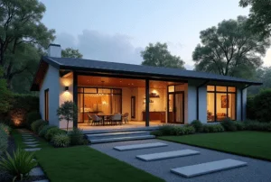

+++
author = "福の家マスター"
categories = ["注文住宅"]
date = 2024-12-23T00:00:00+09:00
tags = ["ハウスメーカー","工務店"]
title = "マイホーム 後悔を防ぐためのチェックポイントと注意点"
toc = true
description = "マイホーム 後悔を防ぐための具体的な対策と注意点を解説。マイホーム 後悔しないために知っておくべきポイントをランキング形式で紹介します。"
+++

マイホームは人生で最も大きな買い物の一つであり、誰もが理想の住まいを手に入れたいと考えるものです。

しかし、実際には購入後に後悔するケースも少なくありません。

後悔の内容は、間取りや収納に対する不満、住宅ローンの負担、近隣環境の問題など多岐にわたります。

さらに、計画不足が原因で家計に影響を与えるマイホーム貧乏に陥る例も見られます。

この記事では、後悔を防ぐためのポイントや適切な購入年齢、平均的な費用、そしてハウスメーカー選びの注意点について解説します。

ランキング形式で具体的な問題点を挙げながら、マイホーム購入を成功させるための実践的な情報をお届けします。

後悔しないために必要な知識をしっかりと確認し、理想の住まいを手に入れる第一歩を踏み出しましょう。


- マイホーム購入で後悔している人の割合とその理由について理解できる
- マイホームで後悔することの具体的なランキングを知ることができる
- マイホーム貧乏の原因と対策を学べる
- 家を購入する適切な年齢と年齢ごとの注意点を理解できる
- マイホームの平均的な費用や必要な予算計画を把握できる
- ハウスメーカー選びのポイントや避けるべき問題点を知ることができる
- 後悔しないための事前準備とチェックリストの重要性を理解できる


  

## マイホームの後悔を防ぐためのポイント

 


- マイホーム購入で後悔している人の割合とは？
- マイホームで後悔していることランキングを解説
- マイホーム貧乏とは？失敗しないための対策
- 家を購入するのは何歳までが限界？年齢別の注意点

  
### マイホーム購入で後悔している人の割合とは？
マイホームを購入することは、多くの人にとって人生最大の買い物です。

そのため、購入後に後悔するケースも少なくありません。

調査によると、マイホーム購入後に後悔している人の割合は全体の約2割から3割と言われています。

これは購入者5人に1人以上が後悔を感じているという驚くべき数字です。

後悔の内容はさまざまですが、代表的な理由として挙げられるのが、「家の間取りやデザインが生活に合わない」「住宅ローンの返済が想像以上に負担になった」というものです。

また、周辺環境や近隣トラブルも後悔の一因になっています。

マイホーム購入は、憧れだけで決断するのではなく、冷静な判断が求められるプロセスです。

例えば、自分たちのライフスタイルを細かく洗い出し、それに合った間取りや設備を選ぶことが重要です。

また、予算についても現実的な範囲で計画を立て、住宅ローンの返済可能額をしっかり見極める必要があります。

さらに、購入を決める前に現地を訪れ、周辺環境や通勤・通学の利便性を確認することも欠かせません。

これらのポイントを押さえることで、購入後の後悔を大幅に減らすことができるでしょう。

一方で、マイホーム購入後に「やはり建てて良かった」と感じる人も多くいます。

その多くが事前に複数のハウスメーカーから見積もりを取り、慎重に比較検討した人々です。

このプロセスを怠ると、予期しない問題が後から発生し、結果的に後悔を招くことになりかねません。

特に「タウンライフ家づくり」など、一括で無料見積もりを請求できるサービスを利用すると、効率的に複数社を比較することが可能です。

これにより、満足度の高い選択ができる確率が大幅に向上します。
  
### マイホームで後悔していることランキングを解説
マイホーム購入後に後悔しているポイントをランキング形式で見ると、具体的な問題点が浮き彫りになります。

このランキングを参考にすることで、事前の計画や注意点を明確にすることが可能です。

1位は「間取りや収納の不満」です。

購入当初は良いと思った間取りでも、実際の生活では不便に感じることがあります。

特に収納スペースの不足は、多くの家庭で問題となっています。

2位は「住宅ローン返済の負担が想定以上」というものです。

家計に占める住宅ローンの割合が高い場合、生活全体に影響が及びます。

その結果、購入を後悔することになるケースが少なくありません。

予算を無理に引き上げることは避け、将来的な収入の変動も考慮した計画が求められます。

3位には「周辺環境や近隣住民とのトラブル」が挙げられます。

購入前には気づかなかった問題が購入後に明らかになることもあります。

例えば、交通の利便性や治安、騒音などです。

また、近隣住民とのコミュニケーションがうまくいかない場合もストレスとなります。

これらの問題を防ぐためには、事前に十分な情報収集を行うことが大切です。

さらに、複数の専門家やハウスメーカーから意見を聞くことで、盲点を減らすことができます。

タウンライフ家づくり」のようなサービスを利用すれば、効率よく情報を収集でき、最適な選択肢を見つけやすくなります。

購入後の満足度を高めるためには、事前の準備が何よりも重要です。

### マイホーム貧乏とは？失敗しないための対策  
マイホーム貧乏とは、マイホームを購入したことで家計のバランスが崩れ、生活が苦しくなる状態を指します。

特に、住宅ローンの返済が収入に対して大きすぎる場合や、購入後の予想外の支出が続く場合に、この状態に陥ることがあります。

購入時の計画不足が原因となることが多いです。

これを避けるためには、事前に綿密な資金計画を立てることが重要です。

住宅ローンを組む際には、返済負担率に注意する必要があります。

返済負担率とは、年間の返済額が収入のどれだけを占めるかを示す指標で、一般的には20～25％以内に収めるのが望ましいと言われています。

これに加え、頭金を多く用意することも、借入金額を減らし返済負担を軽減する効果があります。

また、購入後に発生する費用についても、予め考慮することが大切です。

例えば、固定資産税や修繕費など、毎年のように発生するコストがあります。

特に築年数が増えると修繕の頻度も高くなるため、こうした出費を想定した予備費を確保しておくことが重要です。

事前にこれらの費用を試算し、予算計画に組み込むことが失敗を防ぐ鍵となります。

さらに、複数のハウスメーカーから見積もりを取ることも有効な手段です。

1社だけで決めてしまうと、コストの比較ができず、結果として高い買い物になるリスクがあります。

「タウンライフ家づくり」のような一括見積もりサービスを利用すれば、効率的に複数の選択肢を比較することが可能です。

これにより、価格だけでなく、自分たちのライフスタイルに合ったプランを選びやすくなります。

このように、計画的な準備をすることで、マイホーム貧乏を回避し、安心して新しい生活を始めることができます。

### 家を購入するのは何歳までが限界？年齢別の注意点
家を購入する年齢は、住宅ローンの返済計画やライフプラン全体に大きな影響を与えます。

そのため、購入時の年齢は慎重に検討する必要があります。

一般的には、30代から40代前半が購入のタイミングとして適していると言われていますが、これは個々の状況によります。

30代で購入する場合、ローン返済期間を長く設定できることがメリットです。

また、家族構成の変化を見越した間取り選びがしやすく、将来的な計画を立てやすい点も特徴です。

一方で、収入が安定していない場合や、無理なローンを組むと、生活費に圧迫が生じる可能性があります。

そのため、無理のない範囲で返済計画を組むことが重要です。

40代で購入する場合は、教育費や老後資金の準備が重なる時期となるため、バランスを取った資金計画が必要です。

住宅ローンの返済期間が短くなるため、月々の返済額が高くなる可能性があります。

これを抑えるためには、頭金を多めに用意するか、ローン返済期間の延長を検討するなどの対策が求められます。

50代以降での購入は、老後の生活設計にも大きく影響を与えます。

この時期に無理なローンを組むと、老後資金が不足するリスクが高まります。

そのため、現金購入や短期間で完済可能なローンを検討することが重要です。

さらに、将来の生活スタイルに合った間取りや立地を選ぶことも、購入後の満足度に直結します。

どの年齢であっても、家を購入する際には、長期的な視点での計画が欠かせません。

特に複数のハウスメーカーから見積もりを取り、最適なプランを選ぶことが失敗を防ぐポイントです。

「タウンライフ家づくり」などのサービスを活用すれば、効率よく比較検討ができ、後悔の少ないマイホーム購入が可能となります。

これらの方法を取り入れることで、どの年齢であっても適切な決断ができるでしょう。

## マイホーム後悔しないための具体的な方法

 


- ハウスメーカー最悪のランキングと選び方のコツ
- マイホーム建てるなら何歳がベスト？年齢ごとの適切な計画
- マイホームの平均的な費用はいくらか知っておく
- 無料で簡単に見積もりを取る方法と「タウンライフ家つくり」の活用法
- 最後に見直す！マイホームで後悔しないための重要なチェックリスト


  

### ハウスメーカー最悪のランキングと選び方のコツ
ハウスメーカーを選ぶ際には、多くの人が「最悪の選択をしたくない」と考えています。

しかし、どのメーカーが最悪なのかを一概に判断することは難しいです。

なぜなら、ハウスメーカーごとに得意分野や提供する価値が異なり、何を重要視するかは人それぞれだからです。

一方で、一般的に「最悪」とされるハウスメーカーの特徴として、契約前後で対応が大きく変わる、見積もりが不透明、品質が低いなどが挙げられます。

例えば、契約後に追加費用が多発したり、建築の進行が遅れるといった問題は、施主にとって大きなストレスになります。

また、顧客の要望を十分にヒアリングせず、画一的なプランを押し付けてくるハウスメーカーも、後悔の原因となりやすいです。

このような事態を避けるためには、事前のリサーチが非常に重要です。

まず、インターネット上の口コミサイトやランキングを参考にすることで、評判の良し悪しをある程度把握することができます。

しかし、これらの情報だけに頼るのは危険です。

なぜなら、口コミには個人の主観が含まれるため、必ずしも全てが正確とは限らないからです。

そのため、実際に複数のハウスメーカーに足を運び、担当者と直接話をすることが必要です。

その際、提案内容や見積もりの透明性、質問に対する対応力を比較することで、自分に合ったハウスメーカーを見つけやすくなります。

さらに、「タウンライフ家づくり」などの一括見積もりサービスを利用することで、多くのメーカーの情報を効率的に比較することができます。

これにより、時間と労力を節約しながら、最適な選択をすることが可能となります。

また、ランキングを盲信せず、自分たちのライフスタイルや価値観に合うメーカーを選ぶことも重要です。

例えば、デザインを重視するのか、コストパフォーマンスを重視するのかによって、選ぶべきメーカーは異なります。

これらを明確にしたうえで決定することで、後悔のないマイホームづくりが実現できます。

### マイホーム建てるなら何歳がベスト？年齢ごとの適切な計画
マイホームを建てるタイミングは、人生のライフステージや経済状況によって異なります。

そのため、「何歳がベストか」という問いに対する答えは、人それぞれと言えるでしょう。

しかし、年齢によるメリット・デメリットを理解しておくことで、より適切な計画を立てることができます。

30代でのマイホーム購入は、多くの人にとって理想的なタイミングとされています。

この時期は収入が安定し始め、家族構成が固まりつつあるため、将来のニーズを見据えた間取りの選択が可能です。

また、住宅ローンを長期間で組むことができるため、月々の返済額を抑えることができます。

ただし、収入の伸びが見込めない場合や、無理なローンを組んでしまうと、生活が苦しくなるリスクがあります。

40代での購入は、子どもの教育費や老後資金の準備と並行して進める必要があります。

この時期は、頭金を多く用意することで返済負担を軽減することが重要です。

また、ローンの返済期間が短くなるため、早期に完済する計画を立てることが求められます。

このため、予算オーバーを防ぐために、費用の見積もりやプランの比較を慎重に行う必要があります。

50代以降の購入は、老後の生活に直結する大きな決断となります。

この時期に高額なローンを組むと、老後の資金が不足するリスクが高まります。

そのため、現金購入や短期間でのローン完済を目指すことが現実的です。

また、間取りや立地も、将来の生活スタイルを考慮した選択が必要です。

例えば、バリアフリー設計や駅近の物件は、年齢を重ねても安心して暮らせる環境を提供してくれます。

いずれの年齢であっても、マイホーム購入は大きな決断です。

そのため、購入前に複数のハウスメーカーから見積もりを取り、自分たちに最適なプランを選ぶことが成功の鍵となります。

「タウンライフ家づくり」のようなサービスを活用すれば、手間をかけずに効率よく比較検討ができるため、より良い選択が可能です。

こうした計画的なアプローチを取ることで、どの年齢でも後悔のないマイホームづくりを実現できます。

### マイホームの平均的な費用はいくらか知っておく
マイホームを建てる際に、費用についてしっかりと理解することは非常に重要です。

平均的な費用を知ることで、予算の見積もりが立てやすくなり、後悔を防ぐことができます。

日本国内でマイホームを建てる際の平均的な費用は、地域や建築の種類によって大きく異なります。

一戸建て住宅の場合、土地を購入する費用を含めて平均的に3000万円から4000万円が目安とされています。

この金額には、建物本体の建築費用だけでなく、土地購入費、設計費、各種手数料なども含まれます。

ただし、都市部では土地価格が高騰しているため、総費用がさらに増加することがあります。

一方で、地方では土地価格が安価なため、費用を抑えやすい傾向があります。

また、建物の種類によっても費用は大きく変わります。

木造住宅は比較的安価に建てられる一方で、鉄筋コンクリート造の住宅は耐久性が高いものの建築費用が高くなる傾向があります。

このため、自分たちの予算と必要な住宅性能のバランスを考えながら選ぶことが重要です。

さらに、住宅の平均費用を理解する際には、追加の費用も考慮する必要があります。

例えば、引っ越し費用や家具・家電の購入費用、住宅ローンの手続き費用などです。

これらの費用は見落とされがちですが、全体の予算に大きな影響を与える可能性があります。

そのため、余裕を持った予算計画を立てることが後悔を防ぐポイントです。

平均的な費用を把握することで、理想のマイホームづくりに向けた第一歩を踏み出すことができます。

複数のハウスメーカーや工務店から見積もりを取り、費用を比較することで、自分たちに合った最適なプランを見つけやすくなるでしょう。

### 無料で簡単に見積もりを取る方法と「タウンライフ家つくり」の活用法
マイホームを建てる際には、複数の業者から見積もりを取ることが非常に重要です。

その理由は、業者によって費用や提案内容が大きく異なることがあるためです。

しかし、実際に複数の業者を訪れて見積もりを依頼するのは、時間や手間がかかる作業でもあります。

そのような場合に役立つのが、「タウンライフ家つくり」などの一括見積もりサービスです。

このサービスを活用することで、複数のハウスメーカーや工務店から簡単に見積もりを取ることができます。

利用方法は非常にシンプルです。

まず、自分たちの希望条件や建築予定地の情報を入力します。

その後、条件に合った業者が提案を送ってくれる仕組みになっています。

これにより、複数の提案を比較検討することができ、効率的に最適な選択が可能となります。

また、「タウンライフ家つくり」の最大のメリットは、無料で利用できる点です。

通常、複数の業者に見積もりを依頼すると、それぞれの業者とのやり取りに多くの時間がかかります。

しかし、このサービスを使えば、手間を大幅に省きつつ、多くの選択肢から最適なものを選ぶことができます。

さらに、提案内容も詳細であり、間取りプランや見積もり金額だけでなく、土地の情報や資金計画に関するアドバイスも得ることが可能です。

このように、一括見積もりサービスを活用することで、費用を抑えつつ、納得のいくマイホームを建てることができます。

時間や労力を節約できる点も、大きなメリットと言えるでしょう。

### 最後に見直す！マイホームで後悔しないための重要なチェックリスト
マイホームづくりを成功させるためには、最終的なチェックを怠らないことが重要です。

そのために、重要なポイントをリスト化して確認することで、後悔を未然に防ぐことができます。

まず、費用面について確認することが大切です。

予算オーバーになっていないか、見積もりに漏れがないかを再確認しましょう。

特に、見積もりには細かい項目が多いため、漏れがあると予想以上に費用がかかる可能性があります。

また、住宅ローンの返済計画が現実的であるかも見直すべきポイントです。

無理のない返済計画を立てることで、将来の生活が安定します。

次に、間取りやデザインの最終確認を行います。

自分たちの生活スタイルに合った間取りになっているか、動線が使いやすいかをチェックしましょう。

また、収納スペースが十分に確保されているかも重要なポイントです。

これらは一度建築が始まると変更が難しくなるため、事前にしっかりと確認する必要があります。

さらに、ハウスメーカーや工務店との契約内容も見直しましょう。

契約書に不明点や曖昧な部分がないか、約束事が全て明記されているかを確認することが大切です。

特に、追加費用が発生する条件や工事のスケジュールについては、明確になっているかを確認してください。

最後に、第三者の視点を取り入れることもおすすめです。

家族や友人にプランを見てもらい、意見を聞くことで新たな視点が得られるかもしれません。

また、プロの住宅コンサルタントに相談することで、専門的なアドバイスを受けることも可能です。

これらのチェックを行うことで、マイホームでの後悔を防ぎ、理想の住まいを実現することができます。

しっかりと確認作業を行い、自信を持ってマイホームづくりを進めていきましょう。


- マイホーム購入後に後悔している人は2割から3割存在する
- 購入後の後悔で多い理由は間取りやデザインの不一致
- 住宅ローンの負担が重すぎることが後悔の一因となる
- 周辺環境や近隣トラブルも購入後の後悔の要因となる
- マイホーム貧乏は計画不足が原因で発生する
- 返済負担率は収入の20～25％以内が理想的である
- 住宅ローン以外の固定資産税や修繕費も事前に考慮する必要がある
- 複数のハウスメーカーから見積もりを取ることが後悔を防ぐ方法の一つである
- 「タウンライフ家づくり」の利用は効率的な見積もり取得に役立つ
- マイホーム購入時の適切な年齢は30代から40代が一般的である
- 購入時の年齢により住宅ローンの計画が異なる
- 50代以降の購入は老後資金への影響を考慮する必要がある
- 平均的なマイホームの費用は3000万円から4000万円である
- 見積もりには隠れた追加費用の確認が必須である
- 最終確認として契約内容やプランの詳細を再確認するべきである


  

