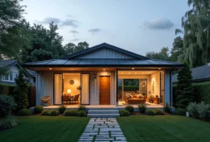

+++
author = "福の家マスター"
categories = ["注文住宅"]
date = 2024-12-28T00:00:00+09:00
tags = ["家づくり","ローコスト","ローン"]
title = "マイホームを諦めた理由を解決する具体的な提案と選択肢"
toc = true
description = "マイホームを諦めた理由や背景を解説し、解決策や新たな選択肢を提案します。マイホームを諦めた後の対処法も徹底解説。"
+++

マイホームを持つことは多くの人にとって人生の目標の一つです。
  
しかし、予算や条件の壁、タイミングを逃したことでマイホームを諦めたという声も少なくありません。
  
マイホーム探しに疲れた、家が買えないみじめさを感じるなど、さまざまな理由で夢を断念する方もいます。
  
一方で、諦められないという気持ちを持ちながら解決策を見つけられず悩む方も多いのではないでしょうか。
  
この記事では、マイホームを諦める理由や断念する背景を紐解きながら、現実的な選択肢や解決策をご提案します。
  
40代以降でも持ち家を実現する方法や、マイホームを建てるなら何歳が適切かといった疑問にもお答えします。
  
諦める前に、ぜひ一緒に新たな可能性を見つけていきましょう。


- マイホームを諦める主な理由と背景を理解できる
- 希望条件と現実のギャップを克服する方法を知ることができる
- 経済的負担を軽減するための資金計画を学べる
- 40代以降でも持ち家を実現する方法を知ることができる
- ハウスメーカーや無料一括見積もりの活用方法を理解できる
- 中古物件やリノベーションの有効性を把握できる
- マイホーム探しに疲れた際の対処法を学べる




  
    「間取りプラン」・「資金計画書」・「土地探し」 すべて無料です。
  

  
申し込むと無料のPDF資料がもらえます。

  

  一括サイトはいろいろありますが、注文住宅を検討している方に、当サイトが圧倒的にオススメしているのは「タウンライフ家づくり」です。</spann> 
  サイト運用歴12年、累計利用者40万人、提携会社1,090社以上（大手メーカー36社含む）の大手ハウスメーカー、地方工務店から選べるので安心です。


あなただけの「家づくり計画書」 を無料でお作りします。



【チャットボット】簡単に 全国の注文住宅会社のプランを比較




## マイホームを諦めた理由と解決策

 


- マイホームを諦めた理由とは？
- 家が買えないと感じるみじめさの克服法
- マイホーム探しに疲れた時の対処法
- 40代で持ち家を諦めた人が知っておきたいこと
- マイホームを諦めた人への前向きな選択肢


### マイホームを諦めた理由とは？
マイホームを諦める理由にはさまざまな背景がありますが、多くの場合、「経済的な問題」「希望条件と現実のギャップ」「タイミングの見失い」の3つに分類できます。

経済的な問題は、多くの人にとって最も大きな障壁です。

住宅ローンを組むための頭金を準備することや、毎月の返済額が家計に大きな負担を与えることが原因です。

特に、物価上昇や金利の変動が続く現在では、予算内に収まる物件を見つけることが以前にも増して困難になっています。

また、住宅ローンの審査基準が厳しくなる場合もあり、この点が購入を躊躇させる要因となっています。

希望条件と現実のギャップも、多くの人がマイホームを諦める理由の一つです。

理想的なエリアや広さ、日当たりなどの条件を追い求める中で、現実的な選択肢を見出すのが難しくなることがあります。

さらに、「もっと良い物件が出るかもしれない」という期待があると、購入の決断を先延ばしにしてしまうことがあります。

結果として、選択肢が狭まり、満足のいく物件に巡り合うチャンスを逃してしまう場合もあります。

加えて、家族構成の変化や転職、転勤といったライフイベントも影響を及ぼします。

これらの変化によって計画が中断されることがあり、購入のタイミングを見失うケースが多々あります。

マイホームは人生で最大の買い物の一つであり、その決断には慎重さが求められます。

しかし、その慎重さが行動を鈍らせ、結果的に諦める原因となることも少なくありません。

これらの要因を解決するためには、適切な情報収集と専門家のアドバイスを受けることが重要です。

専門家の意見を取り入れることで、現実的な選択肢を見つける手助けになるでしょう。

### 家が買えないと感じるみじめさの克服法
家が買えないと感じるみじめさは、多くの人が経験する感情の一つです。

特に、周囲の人が次々と家を購入していく様子を目の当たりにすると、社会的なプレッシャーを感じやすくなります。

これにより、自分の状況に対する不満や焦りが生じ、自己肯定感が下がることがあります。

このような感情を克服するためには、まず自分の経済状況を冷静に見直すことが重要です。

現在の収入や支出、貯蓄のバランスを把握し、自分に合った計画を立てることが必要です。

例えば、無理に新築を追求せず、中古住宅やリノベーション物件を視野に入れると、選択肢が広がります。

また、賃貸生活のメリットに目を向けることも効果的です。

賃貸は維持費の負担が少なく、転勤やライフスタイルの変化にも柔軟に対応できる利点があります。

家を持つことだけが幸せの形ではないと認識することで、心理的な負担を軽減することができます。

さらに、無料の一括見積もりサービスや専門家の相談を利用することで、自分に合った価格帯や条件の物件を見つけやすくなります。

これにより、「家が買えない」という思い込みを解消し、現実的なプランを描くことが可能になります。

どのような状況でも、自分にとって最善の選択を見つける努力を続けることが、前向きな結果を生む鍵となります。

### マイホーム探しに疲れた時の対処法
マイホーム探しは、人生の大きな決断を伴うため、精神的にも体力的にも疲れることがあります。

そのような状況に直面した時には、まず「一旦休む」という選択肢を検討することが大切です。

長期間にわたる探し物は、思考が固まり、新しい視点を見失う原因となります。

少し距離を置くことで、気分をリフレッシュし、改めて冷静に判断できるようになります。

次に、探し方を変えることを試してみましょう。

例えば、希望エリアを少し広げたり、駅近にこだわらず生活の利便性を重視した選択肢を検討することで、新しい可能性が見えてくることがあります。

また、建築士やハウスメーカーに相談することで、狭小地や変形地でも理想の住まいを実現できる提案を受けられる場合があります。

さらに、家探しを効率化するために、不動産アプリや土地情報を自動で取得できるツールを活用することも効果的です。

これにより、情報収集の負担を軽減し、最新の物件情報を逃さず確認することができます。

最後に、家を購入する目的を再確認することも重要です。

マイホームが自分や家族にとってどのような意味を持つのかを考え、優先順位を整理しましょう。

これにより、本当に必要な条件に集中し、計画を再スタートさせることができます。

マイホーム探しに疲れた時こそ、自分自身や家族の未来を見据えて前向きな選択をしていくことが大切です。

### 40代で持ち家を諦めた人が知っておきたいこと
40代で持ち家を諦める決断をすることは、多くの人にとって大きな人生の分岐点です。

しかし、持ち家を持たない選択は決してネガティブなものではありません。

むしろ、このタイミングで生活設計を見直すことで、より柔軟で安定した将来設計が可能になります。

持ち家を諦める背景には、住宅ローンの負担や現在の生活費とのバランス、そして将来の不安などが挙げられます。

特に40代という年齢は、子どもの教育費や老後の資金準備が重なり、多額の出費が見込まれる時期でもあります。

そのため、賃貸という選択肢を取ることで、持ち家に伴う固定資産税や修繕費といったコストを削減することができます。

さらに、賃貸には柔軟性があり、子どもの独立や転職などのライフイベントに応じて住む場所を変えられるというメリットがあります。

また、賃貸生活を送る中で、月々の家賃を将来のための貯蓄に回すことで、老後の資産形成を進めることができます。

不動産購入に比べ、賃貸では住宅ローンの審査を気にする必要がないため、ストレスを感じることなく生活できる点も魅力です。

この時期に意識したいのは、資産形成における多様な選択肢を活用することです。

例えば、賃貸費用を抑えつつ投資信託や株式などの金融商品に資産を分散することで、将来的に自分の選択肢を広げることができます。

一方で、中古住宅やリノベーション物件を視野に入れるのも一つの方法です。

新築住宅にこだわらず、条件に合った中古物件を見つけることで、購入コストを抑えつつ理想的な住まいを手に入れることが可能です。

リノベーションを行うことで、個々のライフスタイルに合ったカスタマイズも実現できます。

また、購入の際には一括見積もりサービスを活用することで、複数の業者から最適なプランを提示してもらうことができ、コスト面での負担軽減が期待できます。

最も重要なのは、自分や家族のライフスタイルに合った選択をすることです。

持ち家に固執せず、自分たちにとって最適な居住形態を見つけることで、40代以降の生活をより充実したものにすることができます。

### マイホームを諦めた人への前向きな選択肢
マイホームを諦めたとしても、人生における選択肢は豊富にあります。

持ち家がなくても、快適で安定した生活を送るための方法はたくさんあります。

まず、賃貸生活を前向きに捉えることが重要です。

賃貸はライフステージの変化に柔軟に対応できる点が魅力です。

例えば、転職や子どもの独立、介護が必要になった場合でも、必要に応じて住まいを変えることができます。

また、賃貸に住むことで固定資産税や修繕費といった経済的な負担が減り、その分を貯蓄や投資に回すことが可能です。

次に、ライフプランを明確にすることも大切です。

持ち家を諦めた場合でも、老後の資金や生活スタイルについて具体的に考えることで、将来への不安を軽減できます。

例えば、子どもの独立後に地方へ移住し、生活費を抑える選択肢や、住まいをシェアすることでコストを削減する方法もあります。

さらに、不動産にこだわらず、他の資産形成に注力することも有効です。

株式や投資信託など、金融商品を利用することで、資産を効率的に増やすことができます。

また、今住んでいる地域での住み替えや、家賃を抑える方法を検討することも現実的な選択肢となります。

最後に、専門家のアドバイスを積極的に取り入れることが成功への鍵となります。

無料の一括見積もりサービスを利用することで、複数のプランを比較検討できるため、自分に合った最適な住まいの選択肢が見つかりやすくなります。

ハウスメーカーや工務店が提供するセミナーに参加し、プロの視点からのアドバイスを受けることで、新たな発見が得られるでしょう。

マイホームを持つことがすべてではありません。

むしろ、柔軟で多様な選択肢を持つことで、人生をより豊かにする道が広がるのです。

  

## マイホームを諦めた人でも叶う夢の手段

 


- マイホームを建てるなら何歳がベスト？
- ハウスメーカーの提案が解決の鍵
- 無料一括見積もりを活用するメリット
- 複数社見積もりで費用を抑える方法
- マイホームを諦めた後の新たな可能性


### マイホームを建てるなら何歳がベスト？
マイホームを建てる際の年齢は、人生設計や経済的な状況によって異なります。

一般的に「35歳前後」が適齢期とされています。

これは、住宅ローンの返済期間を定年退職までに終わらせるためです。

例えば、30代で35年ローンを組むと、65歳頃には完済できる計画が立てやすくなります。

この年齢設定により、老後の生活費負担を軽減し、経済的な安定を確保しやすくなります。

また、30代は収入が安定してくる時期であり、住宅ローン審査でも有利に働きやすいという特徴があります。

しかし、40代以降の購入も珍しくありません。

この場合、ローン期間が短くなるため、月々の返済額が高くなりがちです。

そのため、自己資金を多めに準備したり、頭金を多く入れることで返済計画を調整する必要があります。

逆に、20代で購入を考える場合、将来のライフスタイルの変化を考慮することが重要です。

転職や結婚、子育てといったライフイベントが控えている場合、長期的な視点で計画を立てる必要があります。

最適なタイミングを見つけるためには、ライフプランの見直しと併せて、専門家に相談することをおすすめします。

ハウスメーカーや金融機関は、年齢や収入に応じた返済計画を提案してくれるため、自分にとって最善の選択肢を見つけやすくなるでしょう。

### ハウスメーカーの提案が解決の鍵
ハウスメーカーは、マイホームを建てる際の強力なパートナーです。

彼らの役割は、単に家を建てるだけではありません。

土地探しから間取りの設計、資金計画の提案まで、幅広いサポートを提供します。

特に、土地探しに疲れた人や条件に合う物件が見つからない人にとって、ハウスメーカーの提案は解決策となり得ます。

例えば、狭い土地や変形地など、一見不利に見える条件でも、設計の工夫によって理想的な住まいを実現することが可能です。

また、家族構成やライフスタイルに合わせた柔軟なプランを提案してくれるため、自分たちに合った最適な選択がしやすくなります。

さらに、予算に関しても、ハウスメーカーは顧客の希望を反映しつつ、現実的な価格帯での提案を行います。

資金計画の中では、住宅ローンの仕組みや頭金の必要性、補助金の活用方法なども具体的にアドバイスしてくれることが一般的です。

これにより、購入後の生活も見据えた無理のないプランを立てることが可能になります。

ハウスメーカーの提案は、購入者が感じる多くの不安や課題を軽減し、スムーズな計画進行を実現する鍵となります。

特に、複数のハウスメーカーの提案を比較することで、自分たちにとってベストな選択をすることができます。

一括見積もりサービスを活用することで、より多くの選択肢を短時間で検討できる点も見逃せません。

### 無料一括見積もりを活用するメリット
マイホームを建てる際、無料の一括見積もりサービスを利用することは、非常に効果的な手段です。

このサービスは、複数のハウスメーカーや工務店から一度に見積もりを取ることができ、時間と手間を大幅に節約できます。

特に、初めて家を建てる人にとっては、多くの情報を効率的に収集できる点が大きなメリットです。

無料一括見積もりを活用することで、以下のような利点があります。

まず、複数の業者から提案を受けることで、価格や条件の比較が容易になります。

同じ条件でも、ハウスメーカーによって見積もり内容や追加費用が異なる場合があります。

これを比較することで、最適なコストパフォーマンスを追求することができます。

また、業者ごとの得意分野を把握することも可能です。

デザインに強いメーカーや、コスト重視のプランを提供する工務店など、自分の希望に合ったパートナーを見つける手助けとなります。

さらに、サービスを通じて業者からの提案内容を確認することで、自分の希望条件を見直すきっかけにもなります。

場合によっては、見積もりを通じて新しいアイデアや解決策が得られることもあります。

無料一括見積もりは、購入者が持つ選択肢を増やし、より満足度の高い結果を得るための重要なステップです。

一括見積もりサービスを賢く活用し、自分にとって最適なマイホームを実現してください。

### 複数社見積もりで費用を抑える方法
家を建てる際には、複数のハウスメーカーや工務店から見積もりを取得することが重要です。

これは費用を抑えるためだけでなく、自分に最適な条件を見つける手助けとなる方法でもあります。

まず、複数社から見積もりを取得することで、価格の違いを明確に把握することができます。

同じ条件でも、会社ごとに費用の見積もりが異なる場合が多いです。

例えば、土地の形状に合わせた設計や追加のオプション費用が、会社によって異なる設定になっていることが一般的です。

この違いを比較することで、コストパフォーマンスに優れた提案を選ぶことが可能になります。

次に、見積もりを比較することで、各社の得意分野を知ることができます。

デザイン性に優れた提案を得意とする会社や、コストを最優先にしたプランを提供する会社など、業者によって特色が異なります。

これらの情報を活用することで、理想の住まいを実現するための最適なパートナーを見つけることができるでしょう。

さらに、一括見積もりサービスを活用することで、効率よく情報を収集できます。

複数の会社に個別で問い合わせる手間が省けるだけでなく、同じ条件での提案を一度に比較できるため、時間の節約にもなります。

特に初めて家を建てる方にとっては、専門的なサポートを受けながら計画を進められる点も大きなメリットです。

見積もりを比較する際には、単純な価格だけでなく、含まれる内容にも注意を払う必要があります。

例えば、基礎工事や外構工事などの費用が含まれているか、アフターサービスの内容がどのようになっているかなどを確認してください。

これにより、長期的なコストや安心感も考慮した上で、最善の選択をすることができます。

複数社からの見積もりは、単なる費用比較の手段ではなく、自分たちの希望を叶えるための最適な方法を見つけるプロセスでもあります。

時間をかけて丁寧に検討し、家族の理想に近い住まいを実現する一歩としてください。

### マイホームを諦めた後の新たな可能性
マイホームを諦めたとしても、それは決して終わりを意味しません。

むしろ、これを新たな可能性を探るきっかけと捉えることで、より柔軟な選択肢が広がります。

まず、賃貸生活の利点に目を向けることができます。

賃貸には、物件の維持費や固定資産税が不要であることや、ライフスタイルの変化に応じて住み替えができる柔軟性といったメリットがあります。

例えば、転職や転勤が多い家庭では、賃貸のほうが経済的にも精神的にも安定する場合があるでしょう。

また、マイホームを持つことにこだわらないことで、資金を他の目的に活用する選択肢も生まれます。

教育費や老後資金、趣味や旅行といった自分たちの生活を豊かにするための投資に回すことが可能です。

これにより、家を持つ以上の充実感を得られることもあります。

さらに、マイホームの夢を完全に諦めるのではなく、リノベーション物件や中古住宅に目を向けることも一案です。

中古物件であれば、新築よりも価格が抑えられ、手頃な価格で理想の住まいに近づける可能性があります。

また、リノベーションを行うことで、自分たちの好みに合わせた空間を作り上げることができます。

最近では、共有型の住居やコンパクトな生活を実現するミニマム住宅といった新しい住宅スタイルも注目されています。

これらの選択肢は、従来のマイホーム像に縛られず、より多様なライフスタイルを実現する手助けとなるでしょう。

マイホームを諦めることは、人生の可能性を広げる機会でもあります。

一度立ち止まり、家族や自分自身の将来について考え直すことで、より納得のいく住まいの形を見つけることができるはずです。


- マイホームを諦める主な理由は経済的負担と希望条件のギャップである
- 物件探しの疲れは情報収集と視点の変更で解決できる
- 頭金や返済計画はライフプランに基づいて検討すべきである
- ハウスメーカーは狭小地や変形地でも柔軟な提案が可能である
- 賃貸生活には転勤対応や維持費軽減などの利点がある
- 複数のハウスメーカーを比較することで最適な選択ができる
- 一括見積もりサービスは時間と労力を大幅に節約できる
- 住宅ローン審査では勤続年数や年収の安定が重視される
- 中古住宅やリノベーション物件も選択肢として有効である
- 家探しの優先順位を見直すことで新たな可能性が見つかる
- 土地探しは建築士のアドバイスを受けると効率的である
- 見積もりサービスを利用することで価格交渉が有利になる
- 家を建てる年齢は返済計画のしやすさから35歳前後が推奨される
- 情報過多に陥ったときは専門家に相談すると効果的である
- 「マイホーム 諦めた」と感じても選択肢を広げることで解決できる




  
    「間取りプラン」・「資金計画書」・「土地探し」 すべて無料です。
  

  
申し込むと無料のPDF資料がもらえます。

  

  一括サイトはいろいろありますが、注文住宅を検討している方に、当サイトが圧倒的にオススメしているのは「タウンライフ家づくり」です。</spann> 
  サイト運用歴12年、累計利用者40万人、提携会社1,090社以上（大手メーカー36社含む）の大手ハウスメーカー、地方工務店から選べるので安心です。


あなただけの「家づくり計画書」 を無料でお作りします。



【チャットボット】簡単に 全国の注文住宅会社のプランを比較



