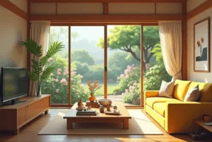

+++
author = "福の家マスター"
categories = ["注文住宅"]
date = 2024-12-29T00:00:00+09:00
tags = ["家づくり","ローン"]
title = "マイホーム ブルーから抜け出す効果的な方法と注意点"
toc = true
description = "マイホーム ブルーに悩む方必見。原因や具体的な解決策、後悔しない家づくりのポイントを詳しく解説します。マイホーム ブルーを防ぐ方法も紹介。"
+++

マイホームの購入は多くの人にとって人生で最大のイベントの一つです。

しかし、その過程で不安やストレスを感じ、マイホームブルーに悩む人も少なくありません。

家を買った後に後悔する理由や、新居への適応が難しい場合の立ち直り方を知りたい人も多いでしょう。

なぜマイホームブルーが起きるのか、その原因を正しく理解することが重要です。

特に、妻が抱えやすい精神的負担や、眠れないほどの不安に対処する方法を知っておくことが役立ちます。

この記事では、マイホームブルーとは何か、その原因や後悔を防ぐためのポイントについて解説します。

さらに、家を買った後に感じる不安を軽減し、マイホームブルーから抜け出す方法を詳しくお伝えします。


- マイホームブルーの意味と主な症状について理解できる
- マイホームブルーの主な原因と引き金を知ることができる
- 家を買った後に感じるブルーの理由を理解できる
- マイホームブルーに陥りやすい妻の特有のストレスを知ることができる
- マイホームブルーを防ぐための具体的な方法を学べる
- 後悔しない家づくりのための計画と準備の重要性を理解できる
- マイホームブルーから抜け出すための実践的なアドバイスを得られる


  

## マイホーム ブルーの原因と対策を解説

 


- マイホームブルーとは何ですか？
- マイホームブルーの原因は？
- 家を買った後、ブルーになるのはなぜ？
- マイホームブルー 妻に起こる原因と影響


### マイホームブルーとは何ですか？
マイホームブルーとは、新築計画中や購入後に気分の落ち込みや不安を感じる状態を指します。

特に、マイホームという人生の大きな買い物に対して抱えるプレッシャーや、新しい環境への適応が主な原因となります。

このような状態は一時的なものであることが多いですが、場合によっては家族間のトラブルや、精神的に深刻な影響を与えることもあります。

マイホームブルーの具体的な症状には、漠然とした不安感、何も手につかない気分の低下、家づくりや新居に対しての興味を失うことなどが挙げられます。

また、理由がわからないままイライラしたり、家族に八つ当たりしてしまうケースもあります。

さらに、新しい家に引っ越した後に気づく問題や、計画段階で抱いていた期待とのギャップが心に影響を与えることがあります。

そのため、マイホームブルーは、家を建てる喜びを妨げるだけでなく、家庭全体の空気を悪化させる可能性もあります。

ただし、このような状態に陥った場合でも、適切な対処を行えば回復することができます。

そのために重要なのは、家づくりを焦らず進めることと、不安や疑問を解決するために相談できる相手を確保することです。

ハウスメーカーや専門家との連携を大切にし、適切な情報を得ることで、マイホームブルーの影響を最小限に抑えることが可能です。

### マイホームブルーの原因は？
マイホームブルーの主な原因には、大きく分けて3つの要因が挙げられます。

第一の原因は、経済的な不安です。

新しい家を購入するには、多額の費用が必要です。

多くの場合、数千万円単位の住宅ローンを組むことになります。

その際、「本当に返済していけるのか」「将来の収入に問題が生じた場合にどうなるのか」といった不安が頭をよぎることがよくあります。

特に、先の見えない経済状況や、ライフプランに関する不確実性がストレスを増大させます。

第二の原因は、家づくりのプロセスそのものが引き起こすストレスです。

家を建てる際には、多くの決定事項が発生します。

間取りや設備、素材の選択など、家族間で意見が割れることも少なくありません。

また、仕事や育児を抱えながら時間を作り、何度も打ち合わせに通うこと自体が疲労の原因となります。

さらに、不動産会社やハウスメーカーとのコミュニケーションに問題が生じた場合、ストレスがさらに増す可能性があります。

第三の原因は、理想と現実のギャップです。

計画段階で「こんな家に住みたい」と描いていたイメージが、完成後に実際の住み心地や環境と異なることがあります。

例えば、住んでみてから間取りの不便さや近隣住民との問題に気づく場合があります。

このようなギャップが、失望や後悔を生み出し、マイホームブルーを引き起こす要因となります。

以上のように、マイホームブルーの原因は複合的であり、それぞれの要因が相互に影響を及ぼす場合があります。

事前に原因を理解し、適切な対策を講じることで、マイホームブルーを回避または軽減することが可能です。

### 家を買った後、ブルーになるのはなぜ？
家を買った後にブルーになる主な理由は、新しい生活への期待と現実とのギャップにあります。

購入前は理想の住まいに夢を膨らませていたものの、いざ住み始めてみると、現実には計画時に気づかなかった問題や不便が浮かび上がることがあります。

例えば、近所づきあいが想定していたより難しい場合や、生活動線の使い勝手が悪いと感じることがあります。

さらに、住宅ローンの返済が始まることで、経済的なプレッシャーを強く感じる方も少なくありません。

また、物件選びや建築の段階で妥協した部分がある場合、その妥協が実際の生活の中で大きなストレスになることがあります。

例えば、予算の都合で間取りや設備を変更した場合、それが生活の中で不便だと感じられると、後悔の念が生まれることがあります。

さらに、地域環境が生活に合わない場合や、子どもの通学が予想以上に大変だと感じる場合にも、このような感情に陥ることがあります。

加えて、新居に伴う費用負担も心理的な負担を増大させます。

家の購入直後には、家具の購入や引っ越し費用、新しい生活に必要な雑費など、さまざまな出費が重なることが一般的です。

これらの費用負担は、家計の余裕を奪い、将来的な不安感を増幅させる原因となることがあります。

家を買った後のブルーを防ぐためには、購入前にできるだけ多くのリサーチを行い、実際の生活をシミュレーションすることが重要です。

また、購入後も、新居を快適にするための工夫や、不満点を解決するためのリフォームや模様替えなどの取り組みを行うことで、気持ちを前向きに保つことができます。

このように、計画段階から実際の生活に至るまで、慎重かつ柔軟に対応することが、ブルーを防ぐための鍵となります。

### マイホームブルー 妻に起こる原因と影響
マイホームブルーが妻に特に影響を及ぼす理由は、家づくりや新生活の準備における役割分担に関連しています。

多くの場合、妻は家族の暮らしに直結する家事動線や収納、インテリアなどの細部に関わることが多く、その負担が精神的なストレスを引き起こすことがあります。

特に、家の購入や建築に伴う多数の決定事項に対して、責任を感じることがストレスの原因となることがあります。

また、引っ越し後には新しい環境に適応し、家族全員の生活がスムーズに進むように配慮する必要があります。

その過程で近隣住民との関係を構築する役割を担うことが多いため、社交的な場面でのストレスを感じる場合があります。

さらに、子どもの学校や日常生活の環境が思っていたものと異なる場合、母親としての責任感から深刻な悩みに発展することもあります。

家事動線や設備、収納などの実際の住み心地に不満を感じることも、マイホームブルーの一因です。

特に、自分の理想を実現しきれなかった場合や、設計段階で妥協した部分が生活の中でストレスとして浮き彫りになる場合があります。

これにより、「もっとこうすれば良かった」という後悔が、精神的な負担となります。

妻がマイホームブルーに陥った場合、家族全体の雰囲気にも影響を与える可能性があります。

気分の落ち込みやイライラが家庭内のコミュニケーションを妨げ、家族間の衝突につながることもあります。

そのため、妻が抱える不安やストレスを軽減するために、夫婦間の対話や周囲の協力が重要です。

妻のマイホームブルーを防ぐためには、家族全員が家づくりや新生活に関与し、意見を共有することが効果的です。

また、妻の負担を軽減するために、専門家や信頼できるハウスメーカーに相談することも有効です。

さらに、問題が発生した場合には、柔軟な対応策を講じることで、安心感を提供することができます。



  
    「間取りプラン」・「資金計画書」・「土地探し」 すべて無料です。
  

 

  
    以下、利用した方々の感想です。（個人の意見です）
  

  一括サイトはいろいろありますが、注文住宅を検討している方に、当サイトが圧倒的にオススメしているのは「タウンライフ家づくり」です。</spann> 
  サイト運用歴12年、累計利用者40万人、提携会社1,090社以上（大手メーカー36社含む）の大手ハウスメーカー、地方工務店から選べるので安心です。


あなただけの「家づくり計画書」 を無料でお作りします。



【チャットボット】簡単に 全国の注文住宅会社のプランを比較




## マイホーム ブルーから抜け出す方法

 


- マイホームブルーから抜け出す具体的な方法
- マイホームブルー 後悔を防ぐ家づくりのコツ
- 複数社一括見積もりの重要性と効果
- マイホーム ブルーを防ぐ「タウンライフ家つくり」の魅力


### マイホームブルーから抜け出す具体的な方法
マイホームブルーから抜け出すためには、まず自分が抱えている不安やストレスの原因を明確にすることが重要です。

多くの場合、住宅ローンの返済へのプレッシャーや、理想と現実のギャップ、家族間での意見の不一致が主な原因として挙げられます。

これらの原因を整理し、一つずつ解決に向けたアクションを取ることで、心の負担を軽減することができます。

例えば、住宅ローンに関する不安がある場合は、家計を見直し、無理のない返済計画を立てることが大切です。

専門家であるファイナンシャルプランナーに相談し、ライフプランに沿った具体的なアドバイスを受けると良いでしょう。

また、家族間で意見が食い違っている場合は、冷静な話し合いを重ねることでお互いの理解を深め、妥協点を見つけることが必要です。

さらに、理想と現実のギャップに悩んでいる場合は、リフォームやDIYを検討することも効果的です。

例えば、間取りの不便さを感じる場合は、家具の配置を見直すことで改善できる可能性があります。

また、収納が足りないと感じる場合には、追加の収納スペースを作るためのDIYに挑戦することも一つの方法です。

これにより、住まいがより快適になり、気持ちも前向きになるでしょう。

マイホームブルーから抜け出すもう一つの方法は、家づくりに関する知識を深めることです。

家づくりのプロセスや不動産に関する情報を収集することで、不安や疑問を解消することができます。

特に、信頼できるハウスメーカーの担当者に相談することは非常に有効です。

自分だけで解決しようとせず、専門家のサポートを受けながら進めることで、心の負担を軽くすることができます。

最後に、マイホームブルーは一時的な感情であることを理解することも重要です。

時間が経つにつれて新しい生活に慣れ、自然と気持ちが落ち着く場合が多いです。

焦らずに自分のペースで対応し、家族と協力しながら解決していくことで、より良い生活を築くことができるでしょう。

### マイホームブルー 後悔を防ぐ家づくりのコツ
マイホームブルーの後悔を防ぐためには、事前にしっかりとした準備と計画を立てることが重要です。

まず、資金計画を慎重に行い、無理のない範囲で予算を設定することが必要です。

多くの方が住宅ローンを利用しますが、「借りられる額」ではなく「返せる額」を基準に考えるべきです。

ライフプランを考慮した上で、収支のバランスを見極めた返済計画を立てることで、購入後の経済的な負担を軽減できます。

次に、家族全員が納得できる家づくりを目指すことも大切です。

家づくりにはさまざまな選択肢があり、家族間で意見が分かれることも少なくありません。

そのため、事前に家族で理想の住まいについて話し合い、絶対に譲れないポイントや妥協できる点を明確にしておきましょう。

また、優先順位をつけることで、時間や予算を効率的に使うことができます。

さらに、土地や周辺環境を十分に確認することも、後悔を防ぐための重要なポイントです。

建設予定地には複数回訪れ、朝・昼・夜と異なる時間帯での状況を確認することをおすすめします。

例えば、交通量や騒音、近隣の生活環境など、実際に住んでみないとわからない要素を事前に把握することで、後から気づく問題を減らすことができます。

また、住宅展示場やモデルハウスを積極的に活用することも有効です。

間取りや動線、設備の使い勝手を実際に体験することで、自分たちの理想に近い住まいをイメージしやすくなります。

さらに、建て主の体験談を聞く機会を設けることで、実際の住み心地や注意点を事前に知ることができます。

最後に、家づくりのパートナー選びにも注意が必要です。

信頼できるハウスメーカーや建築会社と連携することで、不安や疑問を解消しながら進めることができます。

無料で複数社の見積もりを比較できるサービスを活用することで、コスト面でも満足のいく選択が可能になります。

このように、準備と計画をしっかりと行うことで、後悔のない家づくりが実現できるでしょう。

### 複数社一括見積もりの重要性と効果
家づくりを進める際、複数社一括見積もりを活用することは非常に重要です。

その理由は、家づくりには多額の費用がかかり、選択肢が非常に広いからです。

複数のハウスメーカーや工務店から見積もりを取得することで、それぞれの会社が提供する価格やサービス内容を比較しやすくなります。

これにより、自分たちの希望に最も近いプランを選ぶことが可能となり、無駄なコストを抑えることができます。

また、一括見積もりを行うと、それぞれの会社が競争を意識し、より魅力的な条件や価格を提示してくれることがあります。

これは、単一の会社に直接依頼した場合には得られないメリットです。

さらに、一括見積もりでは異なる会社の提案を比較することで、家づくりにおける自分たちの優先順位や具体的なニーズをより明確にすることができます。

例えば、コストを最優先に考えるのか、それともデザインや設備に重点を置くのかといった点を整理する手助けとなります。

もう一つの利点は、見積もりを通じて家づくりの市場価格を把握できる点です。

市場価格を理解することで、提示された価格が適正かどうかを判断でき、過剰な支払いを避けることができます。

加えて、一括見積もりを利用すると、複数の提案を同時に検討できるため、手間を大幅に省くことができます。

一つひとつの会社を個別に訪問して話を聞く必要がなく、効率的に情報を収集することが可能です。

ただし、複数社一括見積もりを利用する際には注意点もあります。

あまりに多くの見積もりを集めすぎると、情報量が多くなりすぎて混乱する可能性があります。

また、見積もり内容は各社で異なる項目や条件が含まれている場合があるため、単純に価格だけで比較しないようにしましょう。

全体的なコストパフォーマンスや、サービスの質、対応力も含めて総合的に判断することが大切です。

以上のように、複数社一括見積もりを活用することは、理想の家づくりを実現するための重要なステップです。

手間を省きながら効率的に情報を集め、最適な選択をするために、積極的に活用してみましょう。

### マイホーム ブルーを防ぐ「タウンライフ家つくり」の魅力
「タウンライフ家つくり」は、家づくりを検討している人々にとって非常に有用なサービスです。

このサービスの最大の魅力は、全国の有名ハウスメーカーや工務店から一括で無料見積もりを取得できる点にあります。

これにより、複数の選択肢を効率的に比較し、自分たちの希望に合ったプランを見つけることができます。

「タウンライフ家つくり」を利用することで、マイホームブルーを防ぐための大きなメリットが得られます。

例えば、新築計画の初期段階で適切な価格帯やプランを把握できるため、後から予算が足りなくなるといった不安を軽減できます。

また、提案を受ける段階で各社の特徴や得意分野を知ることができるため、自分たちの理想の家に近づけるための重要な情報を得ることが可能です。

さらに、このサービスは無料で利用できるため、コスト面での負担を気にすることなく複数の提案を比較できます。

利用者はインターネット上で必要事項を入力するだけで、簡単に見積もり依頼が完了します。

これにより、忙しい日常の中でも効率的に家づくりを進めることができます。

また、詳細な要望を記載すれば、より自分たちのニーズに合った提案を受け取ることができます。

「タウンライフ家つくり」のもう一つの利点は、地域に特化した工務店とも繋がることができる点です。

大手ハウスメーカーだけでなく、地域密着型の工務店の提案も受けることができるため、選択肢が広がります。

このように、多様な提案を受けることで、予算内で理想の家を実現する可能性が高まります。

ただし、「タウンライフ家つくり」を利用する際には、自分たちの希望を明確にしておくことが大切です。

例えば、予算、間取り、設備の優先順位などを具体的に伝えることで、より精度の高い提案を受け取ることができます。

また、提示された提案を比較する際には、価格だけでなく、信頼性や対応力も含めて総合的に判断することが重要です。

「タウンライフ家つくり」を上手に活用することで、家づくりに対する不安を軽減し、マイホームブルーを防ぐことができます。

無料で利用できる便利なサービスを最大限に活用し、理想の住まいを実現しましょう。


- マイホームブルーは家づくりや新居への不安やストレスを指す
- 経済的な不安がマイホームブルーの主な原因となる
- 家づくりのプロセスがストレスの原因になりやすい
- 理想と現実のギャップがマイホームブルーを引き起こす
- 妻がマイホームブルーに陥るケースが多い
- 家族間の意見の不一致がマイホームブルーを悪化させる
- マイホームブルーは家庭全体の雰囲気に影響を与える
- 事前のリサーチがマイホームブルーの予防に効果的である
- 複数社の一括見積もりが不安を軽減する有効な方法である
- 家づくりの専門家に相談することで負担を減らせる
- 新居の模様替えやリフォームがマイホームブルーの改善に役立つ
- 周辺環境や土地選びが後悔を減らす鍵となる
- 家族全員で意見を共有し優先順位を明確にすることが重要である
- タウンライフ家つくりは理想の住まい実現に役立つサービスである
- マイホームブルーは適切な対策で解消可能である




  
    「間取りプラン」・「資金計画書」・「土地探し」 すべて無料です。
  

  
申し込むと無料のPDF資料がもらえます。

  

  一括サイトはいろいろありますが、注文住宅を検討している方に、当サイトが圧倒的にオススメしているのは「タウンライフ家づくり」です。</spann> 
  サイト運用歴12年、累計利用者40万人、提携会社1,090社以上（大手メーカー36社含む）の大手ハウスメーカー、地方工務店から選べるので安心です。


あなただけの「家づくり計画書」 を無料でお作りします。



【チャットボット】簡単に 全国の注文住宅会社のプランを比較



