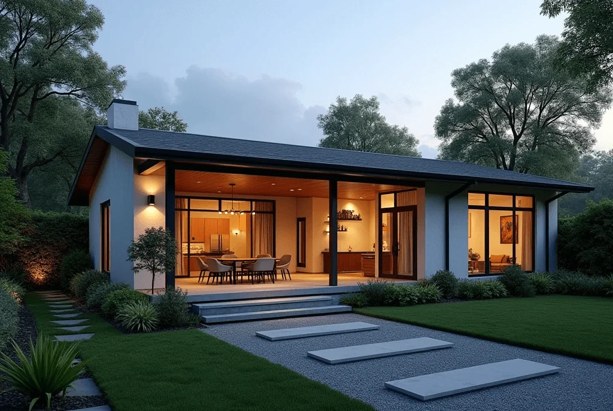

+++
author = "福の家マスター"
categories = ["物件情報"]
date = 2025-02-03T00:00:00+09:00
tags = ["平屋住宅"]
title = "平屋住宅で中古を購入する前に知るべき重要ポイント"
toc = true
description = "平屋住宅 中古を検討中の方必見。新築との価格比較、おしゃれな平屋住宅 中古の選び方、メリット・デメリットを詳しく解説します。"
+++

平屋住宅は、シンプルで暮らしやすい間取りが特徴であり、近年多くの人から注目を集めている。

しかし、新築の平屋住宅は費用が高額になるため、中古物件を検討する人も少なくない。

中古物件であれば、初期費用を抑えつつおしゃれな平屋や庭付きの物件を選ぶことも可能だ。

また、一人暮らしや二人暮らしに適した間取りの平屋を見つけることもできる。

特に2LDKの平屋住宅は、動線がスムーズで生活のしやすさが魅力である。

ただし、激安中古平屋などを選ぶ際には、物件状態や将来的な維持費に注意する必要がある。

この記事では、平屋住宅の中古物件を選ぶ際のポイントやメリット・デメリットについて詳しく解説する。

理想の暮らしを実現するために、これから紹介する情報を参考にしてほしい。


- 平屋住宅の中古物件と新築の価格相場の違いが理解できる
- おしゃれな平屋中古物件を選ぶ際のポイントがわかる
- 一人暮らしや二人暮らしに適した平屋中古物件の探し方がわかる
- 庭付き平屋住宅中古物件のメリットと注意点が理解できる
- 2LDK平屋中古物件の間取りや価格相場の目安がわかる
- 激安中古平屋物件のメリット・デメリットや注意点が理解できる
- 平屋住宅中古物件で後悔しないための最終チェック項目がわかる


  

## 平屋住宅 中古を選ぶ際の基本ポイント

 


- 平屋住宅 中古と新築、それぞれの価格相場を比較
- おしゃれな平屋 中古を選ぶために必要なチェック項目
- 一人暮らし・二人暮らし向けの平屋 中古物件の探し方
- 庭付き平屋住宅 中古物件の魅力と注意すべき点


### 平屋住宅 中古と新築、それぞれの価格相場を比較
平屋住宅を新築する場合と中古物件を購入する場合では、費用に大きな差があります。

新築の平屋住宅では、土地代や建築費、設備費が主な費用項目となります。

30坪程度の新築平屋を建てる場合、地域によりますが、建設費だけで2,000万円から3,000万円が必要です。

また、都市部では土地代が高騰しているため、総額はさらに高額になる可能性があります。

一方、中古平屋住宅の場合は、初期費用を抑えやすいというメリットがあります。

中古物件では建物自体の価格が安いため、1,000万円台から2,000万円台の物件も多く見つかります。

ただし、リフォームや設備の交換が必要な場合は、追加費用が発生することもあります。

価格だけを見ると中古平屋住宅の方が魅力的ですが、設備や劣化具合を考慮した総合的な判断が大切です。

前述の通り、地域ごとの土地価格も費用に影響を与えるため、自分が住みたいエリアの相場を調べておくことが必要です。

### おしゃれな平屋 中古を選ぶために必要なチェック項目
おしゃれな平屋の中古物件を選ぶ際には、いくつかのポイントを押さえる必要があります。

まず、外観のデザインが自分の好みに合っているかを確認しましょう。

中古物件でもデザイン性の高いものが増えていますが、古い物件ではリノベーションが必要になることもあります。

このため、リフォーム可能な範囲や費用についても事前に業者へ相談することが重要です。

次に、内装の状態を細かく確認することが大切です。

例えば、壁紙や床材、天井の高さなどが自分のイメージ通りであるかどうかを見ておくと良いでしょう。

また、家全体の動線がスムーズであるかどうかも、生活のしやすさに大きく影響します。

特にキッチン、リビング、バスルームの配置が効率的かどうかはチェックポイントです。

さらに、採光や通風も快適な暮らしには欠かせません。

窓の位置や大きさ、周囲の環境によって光や風が十分に入るかを確認しましょう。

日当たりが悪いと湿気がこもりやすく、家全体が暗くなってしまいます。

最後に、物件の立地も重要です。

おしゃれなデザインにこだわるあまり、交通や生活利便性を無視すると後悔する可能性があります。

駅やスーパー、病院など、日常生活に必要な施設へのアクセスも重視してください。

これらの項目を総合的に考えながら、自分にとって理想的なおしゃれな平屋中古物件を見つけましょう。

### 一人暮らし・二人暮らし向けの平屋 中古物件の探し方
一人暮らしや二人暮らしで平屋の中古物件を探す際は、必要な広さや間取りを明確にすることが重要です。

一人暮らしの場合は20坪前後、二人暮らしであれば25～30坪程度の広さが一般的な目安となります。

あまり広すぎる物件を選ぶと、掃除や維持管理が大変になるため注意が必要です。

次に、間取りのチェックも欠かせません。

一人暮らしでは、1LDKや2LDKの間取りが使いやすいでしょう。

二人暮らしの場合は、夫婦それぞれのプライベート空間を確保するために2LDK以上の物件がおすすめです。

また、平屋は上下の移動がないため、家事動線がスムーズであることがメリットです。

そのため、生活の動線が無理なく設計されているかを確認しましょう。

さらに、収納スペースも重要なポイントです。

一人暮らしや二人暮らしでは収納が少なくても問題ないと考えるかもしれませんが、必要最低限の収納スペースが確保されている方が快適に暮らせます。

特に、玄関やキッチン周りの収納は生活の利便性に直結します。

また、物件の周辺環境もチェックしましょう。

買い物や通勤、通学など、日常生活に必要な施設が近くにあるかを確認してください。

さらに、一人暮らしや二人暮らしの場合、防犯面も気になるポイントです。

安心して暮らせる環境を選ぶことが大切です。

これらを意識することで、自分にぴったりの平屋中古物件を見つけることができるでしょう。

### 庭付き平屋住宅 中古物件の魅力と注意すべき点
庭付きの平屋住宅 中古物件には、多くの魅力がありますが、同時に注意すべき点も存在します。

まず、庭付き物件の最大の魅力は、開放的な空間を楽しめることです。

自宅でガーデニングや家庭菜園を楽しみたい人には、庭付きの平屋は理想的な住まいとなります。

また、子どもやペットがいる家庭では、安全に遊べるスペースとして庭を活用することもできます。

さらに、庭があることで隣家との距離が確保され、プライバシーを守りやすくなる点もメリットです。

一方で、庭付き物件には維持管理の手間がかかるというデメリットがあります。

定期的な草刈りや植木の剪定を怠ると、庭が荒れてしまい見た目が悪くなるだけでなく、害虫や雑草の問題が発生することもあります。

また、庭の規模によっては、水やりや清掃に多くの時間と労力を費やす必要があります。

さらに、購入前には庭の状態をしっかりと確認しておくことが重要です。

例えば、排水がスムーズに行われているかや、日当たりが良いかなどをチェックしましょう。

特に雨の日に水はけが悪い場合は、後々地盤沈下や水害の原因になることがあります。

加えて、庭を活用する際には近隣住民への配慮も忘れないようにしましょう。

バーベキューや音楽を楽しむ際には、騒音が周囲に迷惑をかけないよう気をつける必要があります。

庭付き平屋住宅の中古物件は、ライフスタイルに合わせてさまざまな楽しみ方ができます。

しかし、その魅力を最大限に活かすためには、維持管理や周辺環境への配慮が欠かせません。

事前に注意点をしっかり把握し、自分に合った物件を選ぶことが大切です。



  
    「間取りプラン」・「資金計画書」・「土地探し」 すべて無料です。
  

 

  
    以下、利用した方々の感想です。（個人の意見です）
  

  一括サイトはいろいろありますが、注文住宅を検討している方に、当サイトが圧倒的にオススメしているのは「タウンライフ家づくり」です。</spann> 
  サイト運用歴12年、累計利用者40万人、提携会社1,090社以上（大手メーカー36社含む）の大手ハウスメーカー、地方工務店から選べるので安心です。


あなただけの「家づくり計画書」 を無料でお作りします。



【チャットボット】簡単に 全国の注文住宅会社のプランを比較




## 平屋住宅 中古を購入する前に確認すべきこと

 


- 平屋住宅 中古物件を効率よく探すためのエリア選び
- 2LDK平屋 中古物件の間取りと価格相場のポイント
- 激安中古平屋物件の注意点とメリット・デメリット
- 平屋住宅 中古物件で後悔しないための最終チェックリスト


### 平屋住宅 中古物件を効率よく探すためのエリア選び
平屋住宅の中古物件を探す際、エリア選びは快適な生活を実現するための重要な要素です。

まず、物件の立地条件が生活に与える影響について考えることが大切です。

近隣に生活に必要な施設が整っているかどうかは、日々の利便性を大きく左右します。

例えば、スーパーやドラッグストア、病院、学校、公共交通機関が近くにあると、時間や労力を節約できます。

特に高齢者や小さな子どもがいる家庭では、急な病気や買い物の際に近場に施設があると安心です。

また、通勤や通学の負担を減らすために、電車やバスなどのアクセス状況も確認しておきましょう。

次に、エリアの環境要因にも注意が必要です。

平屋住宅はすべてが一階に集約されているため、周囲に高い建物が多いと、日当たりや風通しが悪くなる可能性があります。

したがって、近隣の建物状況を現地で確認し、どの程度自然光が入るのか、風通しが良好かどうかを把握することが重要です。

さらに、エリアの将来性も検討しましょう。

市区町村の都市計画や再開発予定があるエリアは、今後の資産価値が高まる可能性があります。

これにより、将来的に物件を売却または賃貸に出す場合、より高い収益を得られる可能性があります。

加えて、地域特有の法規制にも注意が必要です。

平屋住宅は特に建ぺい率（敷地に対する建物の占める割合）に影響を受けやすいため、自治体が定めるルールを事前に確認しておくことが求められます。

以上のように、エリア選びでは利便性、環境、将来性、法規制の4つのポイントを意識することが大切です。

これらを考慮することで、快適かつ資産価値の高い平屋住宅の中古物件を見つけやすくなるでしょう。

### 2LDK平屋 中古物件の間取りと価格相場のポイント
平屋住宅の中古物件で2LDKの間取りは、夫婦2人や小さな子どもがいる家庭にとって人気のある選択肢です。

2LDKとは、リビング・ダイニング・キッチン（LDK）の他に2つの居室がある間取りを指します。

この間取りは、生活動線がシンプルで効率的なため、快適な暮らしを実現しやすい点が魅力です。

まず、2LDKの平屋住宅の特徴として、部屋が一階にまとまっているため、移動が非常にスムーズです。

特に家事をする際、キッチンと各部屋の距離が近いため、掃除や料理、洗濯の動線が短縮されます。

また、階段がないため、高齢者や小さな子どもがいる家庭でも安心して生活できます。

次に、2LDKの中古物件における価格相場について触れていきます。

一般的に、2LDK平屋住宅の価格は地域によって大きく異なります。

都市部では2,000万円から3,500万円程度が相場とされており、人気エリアではさらに高額になることもあります。

一方、郊外や地方都市では、1,000万円から2,500万円程度で購入できるケースもあります。

価格に影響を与える要素としては、立地、築年数、建物の状態、周辺環境、土地の広さなどがあります。

築年数が古い物件の場合、購入後にリフォームが必要なことも少なくありません。

そのため、購入前にリフォーム費用を見積もり、総合的な予算を把握することが大切です。

また、物件見学時には日当たりや風通し、室内設備の状態なども細かくチェックしましょう。

特に平屋住宅では、屋根や外壁の劣化が早い場合があるため、外装のメンテナンス状況を確認しておくと良いでしょう。

最後に、2LDKの平屋住宅は将来的な資産価値にも影響を与える選択肢です。

家族構成が変化した場合でも、リフォームによって間取りを変更することが可能です。

また、将来賃貸物件として運用する際にも、2LDKは需要が高いため有利に働くでしょう。

このように、2LDK平屋住宅の中古物件は、生活の利便性と将来の資産価値のバランスが取れた選択肢としておすすめです。

### 激安中古平屋物件の注意点とメリット・デメリット
激安中古平屋物件は、価格面での魅力がある反面、購入時に注意すべき点が多く存在します。

まず、激安物件の価格が低い理由を明確に理解することが重要です。

多くの場合、築年数が古かったり、メンテナンスが不十分であることが要因として挙げられます。

特に、屋根や外壁、基礎部分などの劣化は見えにくいため、事前に専門家に点検を依頼することをおすすめします。

また、設備が旧式であることも多く、購入後にキッチンや浴室、トイレなどをリフォームする必要が生じるケースが少なくありません。

こうしたリフォーム費用を事前に見積もっておくことで、実際の購入総額が明確になります。

一方で、激安物件にはメリットも存在します。

価格が安いため、初期費用を抑えて物件を取得できることが挙げられます。

また、土地が広い場合には、庭を活用してガーデニングや家庭菜園を楽しむことも可能です。

さらに、リフォームによって自分好みの間取りや内装に改装することで、オリジナリティあふれる住まいを実現できる点も魅力です。

ただし、激安物件にはデメリットもあります。

主なデメリットとして、住宅ローンの審査が通りにくい場合があることが挙げられます。

物件自体の価値が低いと判断されると、金融機関が融資を渋ることがあります。

また、立地が不便なエリアにあることも多いため、周囲の環境や利便性をしっかり確認する必要があります。

以上を踏まえ、激安中古平屋物件を検討する際には、価格だけにとらわれず、物件の状態や今後の維持費を考慮した総合的な判断が求められます。

適切な点検と情報収集を行うことで、後悔のない住まい選びが可能になるでしょう。

### 平屋住宅 中古物件で後悔しないための最終チェックリスト
平屋住宅の中古物件を購入する際、後悔を防ぐためには最終チェックリストを活用することが効果的です。

まず、物件全体の状態を詳細に確認することが必要です。

特に、屋根や外壁、基礎部分の劣化状況を把握することが大切です。

これらの箇所は修繕に高額な費用がかかるため、見落とすと予想外の出費が発生する可能性があります。

また、雨漏りやシロアリ被害の有無も重点的に確認しましょう。

次に、室内設備の状態もチェックが必要です。

キッチン、浴室、トイレ、エアコン、給湯器などの設備が正常に稼働するかを確かめてください。

古い設備は修理費用がかさむため、交換が必要な場合にはその費用を見積もっておきましょう。

さらに、周辺環境の確認も後悔を防ぐためには欠かせません。

物件周辺にスーパーや病院、学校、公共交通機関があるかをチェックし、生活の利便性を確認してください。

また、昼夜の治安や騒音、近隣住民の雰囲気も重要なポイントです。

さらに、法律的な要素も注意が必要です。

物件が建築基準法や都市計画法に違反していないか、建ぺい率や容積率に問題がないかを調べましょう。

特に中古物件は建築当時の基準が現在と異なる場合があるため、専門家のアドバイスを受けることを推奨します。

最後に、購入後のリフォームやメンテナンスの計画も立てておくと安心です。

リフォーム箇所を事前にリストアップし、見積もりを取得することで、費用とスケジュールの管理がしやすくなります。

これらのポイントを最終チェックリストとして活用することで、後悔のない平屋住宅中古物件の購入が可能になります。

細部までしっかり確認し、理想的な住まいを手に入れましょう。


- 平屋住宅 中古と新築の価格相場を比較することが大切である
- 平屋住宅 中古は初期費用を抑えやすいメリットがある
- おしゃれな平屋 中古物件はデザインや内装をしっかり確認する必要がある
- 平屋住宅 中古はリフォーム費用を事前に見積もることが重要である
- 一人暮らし・二人暮らし向けには適切な広さや間取りを選ぶべきである
- 庭付き平屋住宅は開放的な空間を楽しめるが維持管理の手間がある
- 平屋住宅 中古物件を探す際は生活利便性が高いエリアを選ぶべきである
- 2LDK平屋 中古物件は動線が効率的で快適な暮らしが可能である
- 激安中古平屋物件は購入前に劣化や設備の状態を確認すべきである
- 物件見学時には日当たりや風通しの良さをチェックする必要がある
- 平屋住宅 中古の資産価値を考える際、将来のエリア発展も考慮すべきである
- 周辺施設や環境の確認は快適な生活のために欠かせない
- 平屋住宅 中古の購入後は必要なリフォーム計画を立てておくことが推奨される
- 最終チェックリストを活用して物件状態や法的要素を確認することが重要である
- 平屋住宅 中古を選ぶ際は維持管理や生活環境も総合的に判断すべきである




  
    「間取りプラン」・「資金計画書」・「土地探し」 すべて無料です。
  

  
申し込むと無料のPDF資料がもらえます。

  

  一括サイトはいろいろありますが、注文住宅を検討している方に、当サイトが圧倒的にオススメしているのは「タウンライフ家づくり」です。</spann> 
  サイト運用歴12年、累計利用者40万人、提携会社1,090社以上（大手メーカー36社含む）の大手ハウスメーカー、地方工務店から選べるので安心です。


あなただけの「家づくり計画書」 を無料でお作りします。



【チャットボット】簡単に 全国の注文住宅会社のプランを比較



