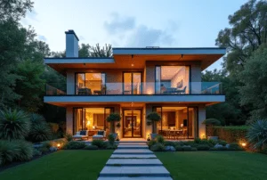

+++
author = "福の家マスター"
categories = ["注文住宅"]
date = 2025-02-07T00:00:00+09:00
tags = ["家づくり","ローン"]
title = "新築一戸建て物件の費用と諸費用を徹底解説"
toc = true
description = "新築一戸建て物件の購入に必要な費用や諸費用を徹底解説。新築一戸建て物件を安く手に入れるための見積もり術や費用節約のポイントも紹介します。"
+++

新築一戸建ての購入を検討している多くの方が、費用や手続きについて不安を抱えています。

物件そのものの価格以外にも、諸費用がどれだけかかるのかを理解していないと、思わぬ出費に悩まされることになりかねません。

特に新築一戸建てを1000万円で建てることは現実的に可能なのか、または4000万円の新築一戸建ての諸費用がどれほどになるのかなど、具体的な費用感を知ることが大切です。

さらに、新築一戸建ての建売を選ぶ場合には、価格の安さや施工内容の確認方法も重要なポイントとなります。

このような費用面や注意点をしっかり理解しておけば、無理のない資金計画を立てながら理想のマイホームを手に入れることが可能です。

本記事では、新築一戸建てをお得に購入するための情報や、建売住宅がダメな理由、必要な費用の詳細について解説していきます。

最後まで読み進めることで、安心して新築一戸建てを購入するための知識を得ることができるでしょう。


- 新築一戸建ての購入にかかる費用の内訳が分かる
- 新築一戸建てを1000万円で建てる際の注意点が理解できる
- 4000万円の新築一戸建ての諸費用の目安が把握できる
- 一戸建ての新築に必要な費用全体の目安が分かる
- 建売住宅のメリットとデメリットが理解できる
- 新築一戸建てを安く購入するための方法が分かる
- 一括無料見積もりの利点と利用方法を知ることができる


  

## 新築一戸建て 物件の費用と諸費用を徹底解説

 


- 新築一戸建ての購入にかかる費用の内訳とは
- 新築一戸建て1000万円で建てることは可能？
- 4000万円の新築一戸建ての諸費用はいくらかかる？
- 一戸建ての新築にかかる費用の目安を知ろう
- 建売住宅がダメな理由？選ぶ前に知っておきたいポイント


### 新築一戸建ての購入にかかる費用の内訳とは
新築一戸建てを購入する際には、物件そのものの価格以外にもさまざまな費用が発生します。

一般的には「諸費用」と呼ばれるこれらの費用は、物件価格の約5%から10%を目安に考えられています。

まず、代表的な費用として仲介手数料があります。

不動産会社を通じて物件を購入する場合、物件価格に対して一定の割合で手数料が課されます。

また、売買契約時には印紙税が必要です。

契約書に課税されるこの税金は契約金額によって異なり、数千円から数万円程度かかります。

さらに、住宅を取得する際には不動産取得税がかかる場合がありますが、一定の条件を満たせば軽減措置が適用されることもあります。

その他、所有権の移転登記や住宅ローンに関連する登録免許税、司法書士への手数料なども発生します。

特に住宅ローンを利用する場合、ローン手数料や火災保険料、ローン保証料といった費用も考慮する必要があります。

このように、新築一戸建ての購入には物件価格以外にも多くの費用が発生するため、事前に内訳を把握しておくことが重要です。

資金計画をしっかり立てることで、購入後に思わぬ出費に悩まされることを防ぐことができます。

### 新築一戸建て1000万円で建てることは可能？
新築一戸建てを1000万円で建てることは、条件によっては可能ですが、現実的には多くの制約が伴います。

まず、1000万円という予算で家を建てる場合、建築費を抑えるためにローコスト住宅が選択肢に挙がります。

ローコスト住宅は、設備や建材のグレードを抑えたシンプルな設計が特徴です。

水回りを集約した間取りや、規格化された設計プランを活用することで、工事費を削減することが可能です。

しかし、コストを抑える代わりに設備の自由度が低くなったり、断熱性能や耐久性が標準的な仕様にとどまるケースが多くなります。

また、土地代を考慮する必要があります。

特に首都圏や地価の高いエリアでは、1000万円では土地を確保することさえ難しいでしょう。

一方、地方の土地価格が安い地域であれば、土地と建物を合わせて1000万円で収められる可能性があります。

さらに、ローンを利用する場合は諸費用も発生しますので、実際の総費用は1000万円を超えることが一般的です。

このため、希望するエリアや建物の仕様に応じて現実的な予算設定をすることが重要です。

不動産会社や建築会社に相談し、複数の見積もりを取り寄せることで、予算に合ったプランを見つけやすくなります。

### 4000万円の新築一戸建ての諸費用はいくらかかる？
新築一戸建ての物件価格が4000万円の場合、諸費用はおおよそ240万円から400万円程度になると考えられます。

これは、物件価格の6%から10%を目安とした一般的な費用割合です。

主な費用として、不動産仲介手数料があります。

これは「物件価格×3%＋6万円＋消費税」で計算され、約138万6000円が上限となります。

また、契約書に必要な印紙税も発生します。

印紙税額は契約金額により異なり、4000万円の場合は1万円が目安となります（軽減措置適用時）。

さらに、所有権移転登記や抵当権設定登記にかかる登録免許税も重要です。

新築住宅では軽減措置が適用され、建物部分は0.3%、土地部分は1.5%の税率が課されます。

加えて、司法書士へ依頼する手数料として約10万円前後が必要です。

住宅ローンを利用する場合、ローン手数料や保証料、火災保険料などの費用が加算されます。

これらの費用を合計すると、300万円近くになることもあります。

前述のように、諸費用の支払いには現金が求められることが多いため、事前に現金の準備を進めておくことが重要です。

このように、4000万円の新築一戸建てを購入する際には、諸費用を見越した資金計画を立てることが必要不可欠です。

### 一戸建ての新築にかかる費用の目安を知ろう
一戸建ての新築には、さまざまな費用が発生します。

まず、建築費は物件の総費用の約70％から80％を占める大きな項目です。

この建築費には、建物本体の工事費（基礎工事や躯体工事、内装工事など）だけでなく、設備工事や外構工事も含まれます。

建物自体の構造や使う素材、設備のグレードによって、この費用は大きく変動します。

次に考えるべきは土地代です。

土地をすでに所有している場合を除き、購入する土地の価格が費用に含まれます。

土地の価格はエリアによって大きな差があり、首都圏や都市部では数千万円単位に達することも珍しくありません。

一方で、地方では比較的安価に土地を購入できるケースも多く、総費用を抑えやすくなります。

さらに、建物を購入する際には諸費用が発生します。

諸費用には、仲介手数料、印紙税、不動産取得税、登録免許税、司法書士への依頼料、そして住宅ローンを利用する場合の手数料や保険料が含まれます。

一般的に、この諸費用は物件価格の5％から10％程度とされています。

例えば、物件価格が3000万円の場合、150万円から300万円程度の諸費用を見込む必要があります。

このように、新築一戸建ての費用を考える際には、土地代・建築費・諸費用を総合的に見ておくことが重要です。

資金計画を立てる際には、これらすべての要素を考慮し、無理のない範囲で予算を設定することが安心な住宅購入のポイントとなります。

### 建売住宅がダメな理由？選ぶ前に知っておきたいポイント
建売住宅にはメリットも多いですが、デメリットや注意すべき点もあります。

これを事前に知っておくことで、後悔のない住宅選びができるでしょう。

まず、建売住宅の一番のデメリットとして挙げられるのが、設計や仕様の自由度が低いことです。

建売住宅は、あらかじめ完成または設計された状態で販売されるため、間取りや設備、内装などを購入者が大きく変更することは難しいです。

そのため、「もっと広いリビングが欲しい」「壁紙の色を変えたい」などの細かい要望が叶わないことがあります。

また、同じ分譲地内で複数の家がほぼ同じデザインや構造で建てられていることが多いため、個性が少ないと感じることもあるでしょう。

次に、施工状況を確認しにくい点もデメリットです。

建売住宅は、短期間に大量に建設されることが多いため、工事の過程を購入者が確認できないことがあります。

その結果、工事がきちんと行われているか、手抜きがないかを事前に確かめられないというリスクがあります。

ただし、近年では住宅性能表示制度による評価や第三者機関の検査を受けている物件も多く、信頼できる業者が提供する物件であれば、品質が確保されていることもあります。

一方、建売住宅には価格が比較的リーズナブルであるというメリットもあります。

まとめると、建売住宅は自由度が低い反面、短期間で手軽にマイホームを持つことができるという利点があります。

購入を検討する際は、事前に物件の仕様や施工状況、住宅性能をしっかり確認することが重要です。

これにより、デメリットを回避しながら自分に合った住まいを見つけることができるでしょう。



  
    「間取りプラン」・「資金計画書」・「土地探し」 すべて無料です。
  

 

  
    以下、利用した方々の感想です。（個人の意見です）
  

  一括サイトはいろいろありますが、注文住宅を検討している方に、当サイトが圧倒的にオススメしているのは「タウンライフ家づくり」です。</spann> 
  サイト運用歴12年、累計利用者40万人、提携会社1,090社以上（大手メーカー36社含む）の大手ハウスメーカー、地方工務店から選べるので安心です。


あなただけの「家づくり計画書」 を無料でお作りします。



【チャットボット】簡単に 全国の注文住宅会社のプランを比較




## 新築一戸建て 物件でお得に購入するための見積もり術

 


- 新築一戸建てを安い価格で手に入れる方法とは
- 新築一戸建て 建売と注文住宅の違いを比較しよう
- 一括無料見積もりが絶対にお得な理由を解説
- 無料見積もりサービス「タウンライフ家つくり」のメリットとは
- 新築一戸建て 物件に関する費用を抑えるためのチェックポイント


### 新築一戸建てを安い価格で手に入れる方法とは
新築一戸建てを安い価格で手に入れるためには、いくつかのポイントを押さえておくことが大切です。

まず、価格を抑えるためには土地選びが重要です。

都心部や人気エリアでは土地価格が高いため、同じ建築費でも総費用が大幅に変わります。

一方で、地方や郊外エリアでは比較的安い価格で広い土地を購入できる可能性があります。

利便性と予算のバランスを考えながら土地を選ぶことが、費用削減の第一歩です。

また、ローコスト住宅を選ぶ方法もあります。

ローコスト住宅は、建材や設備を標準的な仕様に抑えることで建築費を削減した住宅です。

規格化された設計プランやシンプルな間取りが特徴で、無駄を省いた設計によってコストを抑えています。

ただし、設備のグレードや自由度は低くなるため、自分にとっての必要な条件をよく考える必要があります。

さらに、住宅ローンや補助金制度をうまく活用することも効果的です。

例えば、省エネ住宅や長期優良住宅に認定されると、減税や補助金を受けられる場合があります。

これらの制度を利用することで、実質的な費用を抑えることが可能です。

最後に、複数の建築会社から見積もりを取ることをおすすめします。

見積もりを比較することで、価格だけでなくサービス内容やアフターケアの質を確認できます。

これにより、自分に合ったコストパフォーマンスの良い住宅を見つけやすくなります。

### 新築一戸建て 建売と注文住宅の違いを比較しよう
新築一戸建てには「建売住宅」と「注文住宅」の2種類がありますが、これらには明確な違いがあります。

建売住宅は、すでに完成または設計済みの状態で販売される住宅です。

土地と建物がセットになっているため、購入後すぐに住むことができ、手続きや工事に時間がかかりません。

また、建売住宅は一括で建設されることが多いため、工事費や建材費を抑えられ、比較的安い価格で購入できる点がメリットです。

一方で、設計や仕様の自由度が低く、購入者の細かい要望を反映しにくいというデメリットがあります。

例えば、間取りを変更したり、特定の建材を使用したりすることは基本的に難しいです。

一方の注文住宅は、土地の選定から間取りや設備、建材の選択まで、すべてを購入者が自由に決められる住宅です。

自分たちのライフスタイルや好みに合わせた家づくりが可能であり、満足度が高いことが特徴です。

ただし、自由度が高い分、費用が高額になりやすく、建築期間も長くかかります。

また、土地の購入や設計に関する手続きが複雑になることもあるため、専門家との綿密な打ち合わせが必要です。

このように、建売住宅は手軽さと価格の安さ、注文住宅は自由度とこだわりがそれぞれの特徴です。

自分の希望や予算、ライフプランに合った選択をすることが、後悔のない住宅購入につながります。

### 一括無料見積もりが絶対にお得な理由を解説
新築一戸建ての購入を考える際に、一括無料見積もりを利用することは非常にお得です。

その理由は、複数の建築会社やハウスメーカーの見積もりを一度に比較できるためです。

一社だけの見積もりでは、適正な価格やサービス内容が分かりにくいことがあります。

一括見積もりを利用することで、各社の価格帯やプラン内容を比較し、より良い条件を見つけやすくなります。

また、見積もりを複数取ることで価格交渉がしやすくなります。

同様の仕様で他社の見積もりが安い場合、競争原理が働いて値引き交渉が成功する可能性が高まります。

さらに、サービスや保証内容、アフターケアの違いも見比べることができるため、総合的なコストパフォーマンスを重視した選択が可能です。

無料見積もりサービスを利用する際は、「タウンライフ家つくり」など信頼性の高いサービスを選ぶことが大切です。

このようなサービスでは、簡単な情報入力で大手ハウスメーカーや地元の工務店から見積もりを取得できるため、手間がかかりません。

また、複数の会社と連絡を取り合う必要がなく、効率的に情報収集ができます。

見積もりを取らずに契約を進めてしまうと、後から「他社のほうが安かった」「保証が手厚かった」という後悔をすることもあります。

このような事態を防ぐためにも、一括無料見積もりを活用して、賢い住宅購入を進めることをおすすめします。

### 無料見積もりサービス「タウンライフ家つくり」のメリットとは
無料見積もりサービス「タウンライフ家つくり」は、新築一戸建てを検討している方にとって非常に役立つサービスです。

このサービスの最大のメリットは、複数のハウスメーカーや工務店から一度に見積もりを取得できることです。

住宅を建てる際、通常であれば各社と個別に連絡を取り合い、それぞれの見積もりを取得する必要があります。

しかし、「タウンライフ家つくり」では、必要事項を入力するだけで、多くの企業から提案や見積もりが一括で届きます。

これにより、複数の選択肢を効率的に比較することが可能です。

価格やサービス内容だけでなく、間取りプランや設備の詳細まで確認できるため、より具体的な住宅プランをイメージしやすくなります。

さらに、各社が競争する形になるため、価格交渉や条件面での優遇措置が期待できる点も大きなメリットです。

また、住宅業界に詳しくない方にとって、専門用語や手続きが複雑に感じられることがありますが、無料見積もりサービスでは分かりやすい情報が提供されます。

これにより、見積もりの比較や判断がしやすくなり、無駄な出費を避けることができます。

また、利用が無料である点も重要です。

一般的に、複数の会社に見積もりを依頼する場合、見積もり作成費や相談料が発生するケースもあります。

しかし、「タウンライフ家つくり」では、これらの費用が一切かかりません。

そのため、気軽に見積もりを依頼でき、初期段階からしっかりと費用計画を立てることが可能です。

総じて、「タウンライフ家つくり」を利用することで、効率的かつお得に新築一戸建てを計画することができます。

新築住宅は一生に一度の大きな買い物ですので、こうした便利なサービスを活用して、理想の住まいを手に入れましょう。

### 新築一戸建て 物件に関する費用を抑えるためのチェックポイント
新築一戸建てを購入する際、できるだけ費用を抑えるためにはいくつかの重要なポイントを押さえておく必要があります。

まず、土地と建物のバランスを見極めることが大切です。

土地に予算をかけすぎると、建物の仕様を抑えざるを得なくなる場合があります。

そのため、エリアごとの土地相場を事前に調べ、バランスの良い予算配分を考えることが重要です。

また、ローン商品や金融機関の選択も費用に影響を与えます。

住宅ローンには、手数料や保証料、金利などの条件が金融機関ごとに異なります。

同じ借入額でも、金利や手数料の違いによって総支払額に大きな差が生じることがあります。

複数の金融機関で条件を比較し、最適なローン商品を選ぶことで、トータルコストを削減することが可能です。

さらに、住宅性能に注目することもポイントです。

断熱性能や耐久性が高い住宅は、光熱費や修繕費が少なく済むため、長期的なコスト削減につながります。

特に、省エネ性能が高い住宅は補助金や税制優遇措置の対象となることがあり、初期費用を抑えられるメリットがあります。

次に、見積もりの内訳を細かく確認することも重要です。

建築費用に含まれる項目が不明確だと、追加費用が発生するリスクがあります。

見積もりを取得した際には、設備や工事内容が明確に記載されているかをチェックし、分からない点はしっかりと質問しましょう。

また、建築会社によってはキャンペーンや特別割引を提供している場合があります。

これらの情報を見逃さず活用することで、思わぬ費用削減が期待できます。

最後に、必要な保険やメンテナンス費用も考慮しましょう。

火災保険や地震保険は多くの場合必須ですが、保険会社やプランによって費用が異なります。

不要な特約を省くなどして、無駄な支出を防ぐことが重要です。

このようなチェックポイントを押さえることで、新築一戸建てにかかる費用を効率的に抑えながら、安心して購入を進めることができます。


- 新築一戸建ての購入には物件価格以外に諸費用がかかる
- 仲介手数料や印紙税などの費用を事前に把握する必要がある
- 新築一戸建て1000万円の実現には多くの制約がある
- 地方では土地代が安く抑えられるため予算内に収まる可能性がある
- 4000万円の新築一戸建ての諸費用は約6％～10％を見込む必要がある
- 登録免許税や不動産取得税の軽減措置を確認しておくと良い
- 建売住宅は設計や仕様の自由度が低いため要望を反映しにくい
- 建売住宅は価格が安いが施工状況を確認しにくい場合がある
- 注文住宅は自由度が高いが費用や期間がかかる
- 複数のハウスメーカーから一括見積もりを取ることが有効である
- 見積もりの比較により費用交渉や条件の優遇が期待できる
- 無料見積もりサービスを活用することで効率的に情報収集ができる
- 住宅ローンの選択によって総支払額に大きな差が生じる
- 土地代と建築費のバランスを考えた資金計画が重要である
- 長期的に費用を抑えるには住宅性能や補助金制度を活用することが有効




  
    「間取りプラン」・「資金計画書」・「土地探し」 すべて無料です。
  

  
申し込むと無料のPDF資料がもらえます。

  

  一括サイトはいろいろありますが、注文住宅を検討している方に、当サイトが圧倒的にオススメしているのは「タウンライフ家づくり」です。</spann> 
  サイト運用歴12年、累計利用者40万人、提携会社1,090社以上（大手メーカー36社含む）の大手ハウスメーカー、地方工務店から選べるので安心です。


あなただけの「家づくり計画書」 を無料でお作りします。



【チャットボット】簡単に 全国の注文住宅会社のプランを比較



