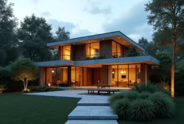

+++
author = "福の家マスター"
categories = ["注文住宅"]
date = 2025-02-18T00:00:00+09:00
tags = ["ハウスメーカー","工務店"]
title = "工務店 デザインとハウスメーカーの違いを徹底比較！最適な選び方"
toc = true
description = "工務店 デザインの選び方やセンスのいい工務店の特徴を詳しく解説。おしゃれな工務店 デザインを見極めるポイントや無料見積もりの活用法も紹介。理想の家づくりを成功させるために、失敗しない工務店選びのコツを学ぼう。"
+++

工務店で家を建てる際に、デザインの良し悪しは重要なポイントとなる。

センスのいい工務店を選ぶことで、理想的な住まいを実現できるが、どのように選べばよいのか悩む人も多い。

ハウスメーカーと工務店の違いを理解し、自分の希望に合ったデザインを提案してくれる会社を見極めることが大切である。

工務店のコンセプトや施工事例、ホームページ制作の工夫をチェックすることで、その工務店のデザイン性やこだわりを知ることができる。

おしゃれな工務店のホームページには、施工実績やコンセプトがわかりやすく掲載されていることが多く、理想のデザインに近い工務店を見つけるための重要な手がかりとなる。

また、デザイン性が高い住宅メーカーにはどのような特徴があるのか、工務店に設計を依頼するとどのくらいの費用がかかるのかも気になるポイントである。

この記事では、良い工務店の特徴やデザインにこだわる工務店の選び方、ホームページ制作がもたらす影響などを詳しく解説する。

工務店選びで失敗しないための知識を身につけ、納得のいく家づくりを進めていこう。


- センスのいい工務店の選び方がわかる
- ハウスメーカーと工務店の違いを理解できる
- デザインにこだわる工務店の特徴を知ることができる
- 工務店のホームページのチェックポイントがわかる
- デザイン性が高い住宅メーカーの特徴を理解できる
- 工務店に設計を依頼した際の費用感を把握できる
- 工務店選びで後悔しないための無料見積もりの活用法を学べる


  

## センスの良い工務店 デザインの選び方

 


- 良い工務店の特徴とは？失敗しない選び方
- ハウスメーカーと工務店のどちらがいい？
- デザインにこだわる工務店のコンセプトとは？
- おしゃれな工務店のホームページをチェックするポイント
- 工務店のホームページ制作が重要な理由


### 良い工務店の特徴とは？失敗しない選び方
良い工務店を選ぶためには、いくつかの重要なポイントを押さえておく必要があります。

まず、施工実績が豊富であることが大切です。

多くの住宅を手掛けている工務店は、さまざまなデザインや建築スタイルに対応できる技術力を持っています。

また、過去の施工事例をホームページなどで確認し、自分の理想とするデザインや間取りに近いものがあるかをチェックすると良いでしょう。

次に、保証制度が充実しているかも確認すべきポイントです。

新築住宅には法律で10年間の瑕疵保証が義務付けられていますが、それ以外の保証やアフターメンテナンスの内容は工務店によって異なります。

定期点検の有無や、万が一のトラブル時にどのような対応をしてもらえるのかを事前に確認しておきましょう。

さらに、スタッフの対応やコミュニケーションのしやすさも重要です。

家づくりは長期にわたるプロジェクトとなるため、信頼できる担当者がいるかどうかは、満足のいく家を建てるための大きな要素になります。

打ち合わせの際に、こちらの要望をしっかりと聞いてくれるか、わかりやすい説明をしてくれるかを確認することで、その工務店が信頼できるかどうかを見極めることができます。

また、地域密着型の工務店であれば、土地の特性や気候条件を熟知しており、適切な建材や工法を提案してくれる可能性が高いです。

地域に根ざした工務店は、評判も確認しやすいため、口コミやレビューを参考にするのも良いでしょう。

最後に、資金計画のサポートがあるかどうかもチェックしておきたいポイントです。

ローンの相談に乗ってくれる工務店であれば、無理のない資金計画を立てることができ、後々の生活にも安心感が生まれます。

良い工務店を選ぶには、これらのポイントを総合的に判断し、慎重に比較検討することが大切です。

### ハウスメーカーと工務店のどちらがいい？
家を建てる際、多くの人が「ハウスメーカーと工務店のどちらを選べばいいのか？」という悩みに直面します。

どちらにもメリットとデメリットがあるため、それぞれの特徴を理解し、自分に合った選択をすることが重要です。

まず、ハウスメーカーの特徴として、大手企業ならではの安定性があります。

全国展開しているハウスメーカーは、建材の仕入れを一括で行うため、品質のばらつきが少なく、均一な施工が可能です。

また、モデルハウスや展示場があることが多いため、実際に住む家の雰囲気を事前に確認しやすい点も魅力の一つです。

一方で、ハウスメーカーは広告宣伝費や営業コストがかかるため、工務店に比べて価格が高くなる傾向があります。

また、規格化されたプランが多く、自由な設計を希望する場合は追加費用がかかることもあります。

次に、工務店の特徴ですが、最大のメリットは自由度の高さです。

工務店では施主の希望に合わせたオーダーメイドの住宅を建てることができ、細かい部分までこだわりたい人には最適な選択肢となります。

また、地域に密着した工務店であれば、土地の特性を考慮した最適なプランを提案してくれることもあります。

さらに、広告費などのコストを抑えられるため、ハウスメーカーよりも低コストで家を建てられる可能性が高いです。

ただし、工務店は企業規模が小さいため、技術力やデザインセンスにばらつきがあることがデメリットとして挙げられます。

また、アフターメンテナンスの充実度も工務店によって異なるため、契約前にしっかりと確認することが大切です。

結論として、ハウスメーカーと工務店のどちらを選ぶかは、「自由度」と「安定性」のどちらを重視するかによります。

規格化された家でも問題なく、安定した品質を求めるならハウスメーカーが向いています。

一方で、デザインや間取りにこだわり、自由度の高い家づくりをしたいなら工務店を選ぶのが良いでしょう。

どちらの選択肢にも一長一短があるため、自分の希望や予算、ライフスタイルに合った方を選ぶことが大切です。

### デザインにこだわる工務店のコンセプトとは？
工務店の中には、デザインに特化した住宅を手掛けるところも多くあります。

そのような工務店のコンセプトには、いくつかの共通点が見られます。

まず、デザインにこだわる工務店は、施主のライフスタイルや価値観を重視した家づくりを行います。

単なる住宅ではなく、住む人にとって快適で個性的な空間を提供することを目的としています。

そのため、施主との打ち合わせに時間をかけ、細かい要望まで丁寧にヒアリングする傾向があります。

次に、自然素材を活かした設計を採用するケースが多いのも特徴です。

木材や漆喰、石材などを用いたデザインは、ナチュラルで温かみのある住空間を生み出し、居心地の良い家を実現します。

また、環境に配慮した設計がなされることもあり、省エネ性能の高い住宅や、エコロジーに配慮した建材を取り入れることも少なくありません。

さらに、空間の使い方にもこだわりが見られます。

限られたスペースを有効活用するために、吹き抜けやスキップフロアを活用した設計を取り入れたり、収納を工夫したりすることで、広々とした住空間を確保する工夫がされています。

デザインにこだわる工務店を選ぶ際には、その工務店の過去の施工事例を確認し、自分の理想とするテイストに合っているかをチェックすると良いでしょう。

また、設計担当者やデザイナーと直接話をすることで、その工務店がどのようなコンセプトを持っているのかを把握することができます。

デザイン性の高い住宅は、見た目だけでなく、快適な生活を送るための工夫が詰まっていることが重要です。

そのため、見た目だけにこだわるのではなく、機能性や居住性もしっかりと考慮した工務店を選ぶことが、満足のいく家づくりのポイントとなります。

### おしゃれな工務店のホームページをチェックするポイント
工務店を選ぶ際に、そのホームページを確認することは非常に重要です。

なぜなら、ホームページには工務店のデザインセンスや施工実績、提供するサービスの特徴など、多くの情報が詰まっているからです。

特に、おしゃれなデザインを得意とする工務店は、ホームページのデザインにもこだわりが反映されていることが多いです。

そのため、施工事例やコンセプトを確認することで、その工務店の得意なデザインテイストが分かります。

また、情報の整理が適切に行われているかも重要なポイントです。

例えば、施工事例がカテゴリーごとに分かれている、工法や素材についての説明が分かりやすい、費用や保証内容が明確に記載されているなど、訪問者にとって知りたい情報が整理されているかをチェックしましょう。

さらに、スタッフの紹介が充実しているかどうかもポイントです。

工務店は、大手ハウスメーカーと異なり、設計から施工、アフターメンテナンスまで同じ担当者が関わることが多いため、信頼できるスタッフがいるかどうかを事前に確認することが大切です。

顔写真付きでスタッフの紹介がされていたり、コメントが載っていたりすると、親しみやすさや信頼感が伝わります。

また、ブログや施工現場の進捗情報を定期的に更新しているかもチェックしましょう。

こうした情報発信が頻繁に行われている工務店は、仕事に対する熱意があり、顧客との関係を大切にしている傾向があります。

逆に、何年も更新されていないホームページの場合、現在の施工状況や会社の方針が分かりにくく、不安を感じることもあります。

さらに、口コミやお客様の声が掲載されているかどうかも重要です。

実際にその工務店を利用した人の感想は、工務店の対応や施工品質を判断するための参考になります。

ただし、ホームページ上の口コミだけでなく、Googleの口コミやSNSのレビューなど、外部の評価も併せて確認することで、より信頼性の高い情報を得ることができます。

おしゃれな工務店を見つけるためには、これらのポイントを押さえつつ、実際に気になる工務店のホームページを比較検討することが大切です。

### 工務店のホームページ制作が重要な理由
工務店にとって、ホームページは単なる情報発信の場ではなく、顧客との重要な接点となるものです。

特に、デザイン性の高い住宅を求める人にとって、工務店のホームページのデザインや使いやすさは、工務店の信頼性やセンスを判断する材料の一つになります。

まず、工務店のホームページがしっかりと作り込まれていることで、顧客の第一印象が良くなります。

おしゃれで見やすいデザインのホームページを持つ工務店は、家づくりに対するこだわりやセンスが伝わりやすく、訪問者に安心感を与えることができます。

一方で、デザインが古く、使い勝手が悪いホームページは、訪問者にとって分かりにくく、問い合わせにつながりにくい原因になります。

また、施工事例の充実度も、ホームページの重要な要素の一つです。

顧客は、実際の施工事例を見ることで、その工務店がどのようなデザインを得意としているのかを判断します。

施工写真が豊富に掲載されているホームページでは、工務店の技術力やデザインの特徴を具体的にイメージしやすくなります。

さらに、施工事例には、どのような素材が使われているのか、設計のポイントは何かなどの解説があると、より分かりやすくなります。

加えて、ホームページ上での情報発信も大切です。

例えば、ブログやニュース記事を通じて、最新の施工状況やイベント情報を発信することで、訪問者に「この工務店は活発に活動している」という印象を与えます。

定期的に更新されているホームページは、工務店が顧客とのコミュニケーションを大切にしている証拠とも言えます。

逆に、長期間更新が止まっている場合、現在の事業活動が分かりにくく、不信感を抱かれる可能性もあります。

さらに、問い合わせフォームやLINE、電話など、顧客が簡単にコンタクトを取れる仕組みが整っていることも、ホームページの重要な役割の一つです。

問い合わせがスムーズにできることで、顧客の不安が解消されやすく、実際に工務店へ足を運ぶきっかけにもなります。

また、FAQ（よくある質問）を掲載することで、顧客の疑問に先回りして答え、問い合わせ前の不安を軽減する工夫も有効です。

このように、工務店のホームページは、単なる広告媒体ではなく、顧客との信頼関係を築くための重要なツールです。

ホームページのデザイン、情報の充実度、更新頻度などを総合的に考え、訪問者が「この工務店にお願いしたい」と思えるような内容にすることが求められます。

## 工務店 デザインを重視した家づくりのポイント

 


- デザイン性が高い住宅メーカーの特徴とは？
- 工務店に設計を依頼すると費用はどれくらい？
- センスのいい工務店を見つける方法
- おしゃれな工務店に共通するデザインのポイント
- 工務店 デザインで後悔しないための無料見積もり活用法


  

### デザイン性が高い住宅メーカーの特徴とは？
デザイン性が高い住宅メーカーには、いくつかの共通する特徴があります。

まず、建築家やデザイナーが設計に深く関与していることが挙げられます。

一般的な住宅メーカーでは、規格化された間取りやデザインが多いですが、デザイン性を重視するメーカーでは、住む人のライフスタイルや要望に合わせて、細部までこだわった設計を行います。

そのため、外観や内装のデザインが統一され、洗練された住宅が提供される傾向にあります。

また、素材選びにもこだわりが見られます。

無垢材や天然石、塗り壁など、一般的な住宅にはあまり使われない高品質な素材を採用することで、デザイン性だけでなく、住み心地の良さや耐久性も高めています。

特に、木材の温もりを活かした北欧風デザインや、モダンなコンクリート打ち放しのデザインなどは、デザイン性が高い住宅メーカーに多く見られるスタイルです。

さらに、住宅の設計において、空間の使い方に工夫が施されていることも特徴の一つです。

例えば、吹き抜けやスキップフロアを活用した開放感のある設計、屋外と室内をシームレスにつなぐ大きな窓、収納スペースを効率的に配置することで、生活感を抑えた美しい空間を実現しています。

また、最新の住宅設備やテクノロジーを積極的に取り入れている点も、デザイン性が高い住宅メーカーの特徴です。

高性能の断熱材や床暖房、スマートホーム機能など、デザインだけでなく、快適性や利便性も兼ね備えた家づくりを行っています。

こうしたメーカーは、単に見た目の美しさだけでなく、住む人の快適性や暮らしやすさにもこだわっているため、長く満足できる住宅を提供することができます。

そのため、デザイン性を重視して住宅を選びたい場合は、メーカーの施工実績を確認し、どのようなデザインが得意なのかをチェックすることが大切です。

また、モデルハウスの見学や設計担当者との打ち合わせを通じて、自分の理想とする住宅を実現できるかを見極めるとよいでしょう。

### 工務店に設計を依頼すると費用はどれくらい？
工務店に住宅の設計を依頼する場合、費用はさまざまな要因によって変動します。

一般的に、注文住宅の設計費用は、工務店が設定する設計料の割合や、家の規模、使用する建材、デザインの複雑さによって異なります。

一般的な目安として、工務店で注文住宅を建てる場合の設計費用は、建築費用の5～10％程度とされています。

例えば、建築費用が3,000万円の場合、設計費用は150万円～300万円程度になることが多いです。

ただし、これはあくまで目安であり、工務店によっては、設計費を建築費用に含めるケースもあれば、別途請求されるケースもあります。

そのため、契約前に設計費用がどのように算出されるのかをしっかりと確認しておくことが重要です。

また、設計の自由度が高いほど、費用も高くなる傾向があります。

特に、オーダーメイドのデザインや特殊な素材を使用する場合は、設計費が割増になることがあります。

例えば、開放的な吹き抜けや、大きなガラス窓を多用したデザイン、複雑な屋根構造などは、設計の手間が増えるため、費用が高くなる可能性があります。

一方で、工務店の標準仕様に近い設計を選べば、設計費を抑えることができます。

さらに、工務店によっては、設計費用を抑えるために、基本プランをいくつか用意している場合もあります。

これをベースにして、部分的なカスタマイズを行うことで、費用を抑えつつ、自分の理想に近い住宅を建てることが可能です。

工務店に設計を依頼する際には、まず予算を明確にし、どの程度の設計自由度を求めるのかを整理しておくことが重要です。

また、複数の工務店から見積もりを取り、設計費用の比較をすることで、適正な価格で設計を依頼することができます。

### センスのいい工務店を見つける方法
センスのいい工務店を見つけるためには、いくつかのポイントを押さえることが大切です。

まず、施工事例をチェックすることが重要です。

多くの工務店は、自社のホームページやSNSで過去の施工事例を公開しています。

これを確認することで、その工務店のデザインの方向性やセンスを判断することができます。

特に、自分が求めるデザインに近い事例が多い工務店は、希望に沿った提案をしてくれる可能性が高いです。

また、施工事例の写真が綺麗に撮影されているかもポイントになります。

写真のクオリティが高い工務店は、細部にまでこだわりを持っていることが多く、施工の質にも期待ができます。

次に、ホームページのデザインや情報の整理の仕方もチェックしましょう。

センスのいい工務店は、ホームページ自体のデザインにもこだわっていることが多いです。

分かりやすく見やすいホームページは、工務店の仕事に対する姿勢やこだわりを反映している場合が多いため、重要な判断材料になります。

さらに、モデルハウスや完成見学会に参加することもおすすめです。

実際に建てられた家を見学することで、工務店のデザイン力や施工の質を肌で感じることができます。

また、見学会では工務店のスタッフと直接話をすることができるため、対応の丁寧さや提案力も確認できます。

センスのいい工務店は、施主の要望を細かく聞き取り、それを形にする力があります。

打ち合わせの際に、こちらの希望に対して的確な提案をしてくれるかどうかも、判断基準の一つになります。

また、口コミや評判をチェックすることも大切です。

実際にその工務店で家を建てた人の意見は、工務店の対応や施工品質を知るための貴重な情報源です。

Googleの口コミや、住宅関連の掲示板、SNSなどを活用して、評価が高い工務店を見つけることが重要です。

これらのポイントを押さえて、デザインセンスがあり、信頼できる工務店を選ぶことで、理想の住まいを実現することができます。

### おしゃれな工務店に共通するデザインのポイント
おしゃれな工務店には、いくつか共通するデザインのポイントがあります。

住宅のデザインは単に見た目の美しさだけでなく、機能性や住み心地にも直結する重要な要素です。

そのため、デザインにこだわる工務店は、細部まで計算された設計を行い、住む人にとって快適な空間を提供しています。

まず、おしゃれな工務店のデザインに見られる特徴の一つは「統一感のあるデザイン」です。

外観と内装が調和し、まとまりのある仕上がりになっている住宅は、洗練された印象を与えます。

たとえば、ナチュラルモダンや北欧風、インダストリアルデザインなど、特定のスタイルに沿って設計された住宅は、美しい仕上がりになります。

また、工務店が使用する建材や色合いにも統一感があると、デザインの完成度が高くなります。

次に、「素材へのこだわり」も重要なポイントです。

おしゃれな工務店は、一般的な住宅ではあまり使われない高品質な素材を積極的に採用しています。

例えば、無垢材のフローリング、珪藻土や漆喰の塗り壁、アイアンを用いたアクセントデザインなど、素材の質感を活かした設計が特徴的です。

自然素材を取り入れることで、温かみのある住まいを実現し、住む人にとって居心地の良い空間を作り出します。

さらに、「開放感のある空間設計」も、おしゃれな工務店のデザインに共通するポイントです。

広々としたリビングや吹き抜け、スキップフロアなど、空間を有効活用する工夫が施されている住宅は、実際の面積以上に広く感じることができます。

また、大きな窓を設置し、自然光をたっぷり取り入れることで、明るく開放的な空間を演出することが可能です。

室内と庭をつなぐウッドデッキやテラスも人気のデザイン要素で、屋内外の一体感を生み出します。

「シンプルながらも洗練されたデザイン」も、おしゃれな工務店が目指すポイントです。

過度な装飾を省き、シンプルなラインやミニマルなデザインを取り入れることで、長く愛される家が完成します。

余計な要素を削ぎ落とし、機能性を重視したデザインは、時代に左右されにくく、長期間にわたって快適に暮らせる住まいになります。

特に、北欧風や和モダンのデザインは、このシンプルな美しさを大切にしています。

最後に、「生活動線を考えた設計」も、おしゃれな工務店が得意とするデザインの一つです。

見た目の美しさだけでなく、日々の暮らしが快適になるように、動線設計が工夫されています。

たとえば、玄関からキッチンへの直通動線を設けることで買い物帰りの荷物をすぐに片付けられるようにしたり、洗濯スペースと物干し場を近くに配置することで家事の負担を軽減したりと、細かい配慮が施されています。

このように、おしゃれな工務店は、デザインの美しさだけでなく、素材の選定、空間設計、生活動線など、多方面から住み心地の良い住宅を追求しています。

デザイン性の高い家を建てたい場合は、こうしたポイントを押さえて工務店を選ぶことが重要です。

また、施工事例を確認し、自分の理想に近いデザインを得意とする工務店を選ぶことが、理想の住まいづくりの第一歩となります。

### 工務店 デザインで後悔しないための無料見積もり活用法
工務店で住宅を建てる際に、デザインやコストの面で後悔しないためには、無料見積もりを上手に活用することが重要です。

工務店選びに失敗すると、予算オーバーや思い描いていたデザインと違う仕上がりになってしまうこともあります。

そのため、最初の段階でしっかりと見積もりを取り、比較検討することが必要です。

まず、無料見積もりを活用する最大のメリットは、複数の工務店の提案を比較できることです。

1社だけの見積もりでは、その工務店の価格設定が適正かどうかを判断することが難しくなります。

しかし、複数の工務店から見積もりを取ることで、相場感を把握し、最もコストパフォーマンスの良い工務店を選ぶことができます。

また、見積もりを比較することで、どの工務店が自分の希望するデザインに対応できるかも明確になります。

次に、見積もりを取る際には、単に価格だけで判断するのではなく、詳細な内訳を確認することが大切です。

例えば、設計費用、建材のグレード、施工管理費、保証内容など、細かい項目ごとに費用が明記されているかをチェックしましょう。

一見安い見積もりでも、後から追加費用が発生する場合があるため、初めからすべての費用が含まれているかどうかを確認することが重要です。

また、無料見積もりを依頼する際には、自分の希望や条件を明確に伝えることも大切です。

家のデザインや間取り、使用したい素材、希望する設備などを具体的に伝えることで、より正確な見積もりを出してもらうことができます。

逆に、漠然とした依頼をすると、工務店ごとに異なる前提で見積もりが作成され、比較しにくくなってしまうため注意が必要です。

さらに、無料見積もりを依頼する際には、オンラインの一括見積もりサービスを活用するのもおすすめです。

一括見積もりサービスを利用すると、複数の工務店から一度に見積もりを取得できるため、効率的に比較することができます。

また、厳選された優良工務店のみが登録されているサービスを利用すれば、信頼性の高い工務店の中から選ぶことが可能です。

最後に、見積もりを比較する際には、費用だけでなく、工務店の対応や提案内容にも注目することが重要です。

質問に対して丁寧に答えてくれるか、こちらの希望をしっかりと理解しようとしてくれるかなど、対応の良し悪しを確認することで、信頼できる工務店を見極めることができます。

このように、無料見積もりを上手に活用することで、コスト面だけでなく、デザインの面でも後悔しない家づくりを実現することができます。

複数の工務店の見積もりを比較し、費用やデザイン、対応の丁寧さなどを総合的に判断することで、自分にとって最適な工務店を見つけることができるでしょう。


- 良い工務店を選ぶには施工実績や保証制度を確認することが重要
- ハウスメーカーと工務店の違いを理解し、自分に合った選択をするべき
- デザインにこだわる工務店は、施主のライフスタイルに寄り添った提案をする
- おしゃれな工務店のホームページはデザイン性が高く、施工事例が充実している
- 工務店のホームページ制作は、信頼性やブランディングに直結する要素である
- デザイン性が高い住宅メーカーは、建築家が関与し、素材や空間設計にこだわる
- 工務店に設計を依頼する場合、費用は建築費用の5～10%程度が相場
- おしゃれな工務店は素材選びや開放的な空間設計に工夫を凝らしている
- 生活動線を考慮した設計がされている工務店は、住みやすい家を提供する
- 工務店で後悔しないためには無料見積もりを活用し、複数社を比較するべき
- 無料見積もりでは、費用の内訳や追加料金の有無を必ずチェックする
- デザイン重視の家づくりをしたいなら、工務店の得意とするスタイルを事前に確認する
- オンラインの一括見積もりサービスを活用すると、効率的に工務店を比較できる
- 工務店の対応や提案力も見極め、信頼できる会社を選ぶことが重要




  
    「間取りプラン」・「資金計画書」・「土地探し」 すべて無料です。
  

 

  
    以下、利用した方々の感想です。（個人の意見です）
  

  一括サイトはいろいろありますが、注文住宅を検討している方に、当サイトが圧倒的にオススメしているのは「タウンライフ家づくり」です。</spann> 
  サイト運用歴12年、累計利用者40万人、提携会社1,090社以上（大手メーカー36社含む）の大手ハウスメーカー、地方工務店から選べるので安心です。


あなただけの「家づくり計画書」 を無料でお作りします。



【チャットボット】簡単に 全国の注文住宅会社のプランを比較



