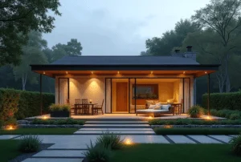

+++
title = "マイホームのキッチンを理想の空間にするための見積もり活用術"
author = "福の家マスター"
categories = ["注文住宅"]
date = 2025-02-25T00:00:00+09:00
tags = ["間取り", "ハウスメーカー", "工務店"]
toc = true
description = "マイホーム キッチンの間取りやレイアウト選びで失敗しないためのポイントを解説。人気のキッチンランキングや使いやすい設計のアイデアも紹介。理想のマイホームキッチンを実現するための無料見積もりの活用法も詳しく解説。"
+++
マイホームのキッチンは、毎日の生活の中心となる重要な空間である。
  
理想のキッチンを実現するためには、間取りやレイアウト、設備の選び方が大切になる。
  
注文住宅のキッチンでは、動線や収納の工夫が必要であり、後悔しないためのポイントを押さえておくことが重要だ。
  
また、キッチンレイアウト実例を参考にすることで、成功事例を学び、より使いやすいキッチンを計画できる。
  
さらに、キッチン間取りのアイデアを知ることで、家族全員が快適に使えるスペースを確保できる。
  
近年、注文住宅のキッチンランキングでは、対面型やアイランド型のキッチンが人気を集めている。
  
しかし、どのスタイルを選ぶかは、ライフスタイルや住宅の広さによって変わるため、自分に合った選択が求められる。
  
特に、キッチン間取りの後悔を防ぐためには、複数のプランを比較しながら検討することが大切だ。
  
本記事では、理想のキッチン間取りやレイアウトの基本、注文住宅のキッチンで後悔しないためのポイント、実際のレイアウト実例などを詳しく解説する。
  
さらに、一括無料見積もりを活用することで、コストを抑えつつ、自分に最適なキッチンプランを見つける方法も紹介する。
  
これからマイホームのキッチンを計画する人にとって、役立つ情報を提供するので、ぜひ参考にしてほしい。


- 理想のキッチンの間取りとレイアウトの基本を理解できる
- 注文住宅のキッチンで後悔しないためのポイントを学べる
- 使いやすいキッチンの間取りを考えるコツが分かる
- キッチンレイアウト実例を参考に成功事例を知ることができる
- 注文住宅の人気キッチンランキングとトレンドを把握できる
- 複数のハウスメーカーから見積もりを取る重要性を理解できる
- 一括無料見積もりを活用して最適なキッチンプランを見つける方法が分かる


  

## 失敗しないマイホーム キッチンの選び方

 


- 理想のキッチンの間取りとレイアウトの基本
- 注文住宅で後悔しないキッチン間取りのポイント
- 使いやすいキッチンの間取りを考えるコツ
- キッチンレイアウト実例で学ぶ成功事例
- 注文住宅のキッチンランキング！人気のタイプは？


### 理想のキッチンの間取りとレイアウトの基本
キッチンの間取りとレイアウトは、マイホームを建てる際に重要なポイントの一つです。

キッチンは、日々の食事を作るだけでなく、家族とのコミュニケーションの場にもなります。

そのため、間取りやレイアウトを適切に設計することで、快適で使いやすい空間を作ることができます。

キッチンの間取りには、オープン型、セミオープン型、独立型の3種類があります。オープン型は、リビングやダイニングと一体化しているため、開放感があり家族との会話も弾みます。

しかし、調理中のニオイや煙が広がりやすいというデメリットもあります。セミオープン型は、カウンターなどで仕切りを設けることで、開放感を保ちつつも目隠し効果を得ることができます。

独立型は、キッチンを完全に別の部屋として設計するため、調理に集中しやすく、来客時にも生活感を隠せるのが特徴です。

レイアウトには、I型、L型、U型、アイランド型、ペニンシュラ型などがあります。

I型は、キッチン設備が一直線に並んでおり、省スペースで効率的に作業ができます。

L型は、作業スペースが広く、効率的な動線を確保しやすいのが特徴です。

U型は収納力が高く、作業スペースも広いですが、設置に広いスペースが必要になります。

アイランド型は、キッチンの中央に調理台を設けることで、複数人で作業しやすくなりますが、スペースが必要になります。

ペニンシュラ型は、アイランド型の一部を壁に接する形にすることで、省スペースながらも開放感を演出できます。

このように、キッチンの間取りやレイアウトは家族のライフスタイルに合わせて選ぶことが重要です。

使いやすさとデザインのバランスを考えながら、自分に合ったキッチンを設計しましょう。

### 注文住宅で後悔しないキッチン間取りのポイント
注文住宅を建てる際に、キッチンの間取りで後悔しないためには、いくつかのポイントを押さえることが大切です。

まず、動線をしっかりと考えることが重要です。

キッチンでの作業は、「冷蔵庫から食材を取り出す」「シンクで洗う」「調理をする」「配膳する」という流れが基本になります。

この動線を短くすることで、無駄な動きを減らし、スムーズな調理が可能になります。

特に、冷蔵庫、シンク、コンロの位置関係を意識して、最適なワークトライアングルを確保することがポイントです。

また、収納スペースも十分に確保することが大切です。

キッチンは調理器具や食器、調味料など収納するものが多いため、使い勝手の良い収納を計画することで、スッキリとした空間を保つことができます。

引き出し式のキャビネットやパントリーを活用することで、必要なものをすぐに取り出せるように工夫しましょう。

さらに、キッチンの広さや通路幅も重要な要素です。

一般的に、キッチンの通路幅は90cm〜120cmが理想とされています。

狭すぎると家族がすれ違う際にストレスを感じ、広すぎると作業動線が長くなり効率が悪くなります。

最後に、キッチンの位置や配置を考えることも大切です。

キッチンをリビングに隣接させることで、家族とのコミュニケーションがとりやすくなります。

また、窓を設けることで換気しやすくなり、自然光を取り入れることで明るい空間を作ることができます。

注文住宅のキッチンを設計する際には、これらのポイントを押さえて、後悔のない理想のキッチンを作りましょう。

### 使いやすいキッチンの間取りを考えるコツ
使いやすいキッチンにするためには、間取りを工夫することが必要です。

まず、家事動線を短くすることがポイントです。

キッチン内の移動距離が長くなると、調理や片付けに時間がかかってしまいます。冷蔵庫、シンク、コンロの位置関係を最適にすることで、効率よく作業できるようになります。

特に、ワークトライアングルがコンパクトにまとまっていると、スムーズに調理ができるでしょう。

次に、収納計画をしっかりと立てることが重要です。

使いやすいキッチンを作るためには、収納の位置と量を適切に確保することが不可欠です。

調理器具や食材を分類し、それぞれ取り出しやすい場所に収納できるようにしましょう。

パントリーを設置することで、ストック食品や大きな調理器具を収納するスペースを確保できます。

また、コンセントの配置にも気を配る必要があります。

キッチンでは電子レンジ、炊飯器、ミキサー、電気ポットなど、さまざまな家電を使用するため、必要な場所に十分なコンセントを設置することが大切です。

調理台の近くや、作業スペースのすぐそばにコンセントがあると、家電を使いやすくなります。

さらに、換気のしやすさも考慮しましょう。

調理中の煙やニオイをしっかり排出するためには、換気扇やレンジフードの性能が重要です。

特に、オープンキッチンの場合は、リビングやダイニングにニオイが広がりやすいため、換気機能の高い設備を導入するのがおすすめです。

最後に、照明計画を工夫することで、快適なキッチン空間を作ることができます。

調理台には手元を明るく照らす照明を設置し、キッチン全体を均一に照らすための天井照明も組み合わせるとよいでしょう。

ダウンライトや間接照明を活用することで、おしゃれで快適な雰囲気を演出することができます。

これらのポイントを考慮しながら間取りを設計することで、使いやすく快適なキッチンを作ることができます。

マイホームのキッチンは、毎日使う重要な場所だからこそ、しっかりと計画を立てて設計しましょう。

### キッチンレイアウト実例で学ぶ成功事例
キッチンのレイアウトは、使いやすさやデザイン性に大きな影響を与えます。

実際に成功しているキッチンレイアウトの事例を知ることで、自分の理想に近いスタイルを見つけやすくなります。

ここでは、人気のキッチンレイアウトとその成功事例を紹介します。

まず、一番シンプルで取り入れやすいのが「I型キッチン」です。

このレイアウトは、シンク・コンロ・冷蔵庫が一直線に並んでいるため、コンパクトなスペースでも設置しやすいのが特徴です。

特に、限られたスペースの中で動線を最小限に抑えたい場合に向いています。

例えば、マンションや狭めの戸建て住宅では、I型キッチンを壁付けにすることで、ダイニングやリビングのスペースを広く確保することができます。

一方で、収納力が限られるため、壁面収納やパントリーを活用すると使いやすくなります。

次に、多くの注文住宅で採用されているのが「L型キッチン」です。

このレイアウトは、キッチンの作業スペースをL字型に配置することで、ワークトライアングルを最適化できるのが魅力です。

例えば、冷蔵庫・シンク・コンロをL字型に配置することで、移動距離を短縮し、調理の効率を向上させることができます。

また、壁側に収納を配置しやすいため、スッキリとしたデザインに仕上げることが可能です。

L型キッチンの成功事例としては、ダイニングとキッチンをゆるやかにつなげることで、家族とのコミュニケーションが取りやすい空間を作ったケースが挙げられます。

ただし、キッチンの広さによってはデッドスペースが生まれることがあるため、角の収納スペースを有効活用する工夫が必要です。

さらに、おしゃれで機能的なレイアウトとして人気なのが「アイランドキッチン」です。

このレイアウトでは、キッチンが部屋の中央に配置され、四方からアクセスできるため、複数人で調理を楽しむことができます。

特に、ホームパーティーを頻繁に開催する家庭や、家族で一緒に料理をする機会が多い場合に最適です。

成功事例としては、広々としたリビングダイニングとアイランドキッチンを一体化させ、開放感のある空間を実現したケースがあります。

ただし、十分なスペースを確保しないと、通路幅が狭くなり動きにくくなるため、設計時には注意が必要です。

また、オープンなレイアウトのため、油はねやニオイ対策として、換気性能の高いレンジフードを導入することが重要です。

最後に、アイランドキッチンと並んで人気なのが「ペニンシュラキッチン」です。

このレイアウトは、アイランドキッチンの片側を壁に接する形にすることで、スペースを有効活用しながら開放感を確保できるのが特徴です。

例えば、小さめのリビングダイニングでも、キッチンと空間を一体化しやすく、すっきりとしたデザインにすることが可能です。

成功事例では、ペニンシュラキッチンの前面にカウンターを設置し、食事や作業スペースとして活用することで、家事の効率を向上させたケースがあります。

また、アイランドキッチンと比べて収納を増やしやすいため、使い勝手を重視したい方にもおすすめです。

以上のように、キッチンのレイアウトにはさまざまな種類があり、それぞれにメリットとデメリットがあります。

家族のライフスタイルや、どのようにキッチンを活用したいかを考えながら、自分に合ったレイアウトを選ぶことが大切です。

### 注文住宅のキッチンランキング！人気のタイプは？
注文住宅のキッチンにはさまざまな種類がありますが、近年人気の高いキッチンスタイルには共通する特徴があります。

ここでは、特に注目されているキッチンの種類と、その魅力について紹介します。

まず、注文住宅で最も人気があるのが「対面キッチン」です。

このキッチンは、リビングやダイニングと向かい合う形で設置されているため、家族とのコミュニケーションを取りやすいのが特徴です。

特に、小さなお子さんがいる家庭では、料理をしながら子どもの様子を確認できるため、安心感があります。

また、キッチンの前にカウンターを設置すれば、食事の準備や後片付けがスムーズにできるのもメリットです。

ただし、対面キッチンはリビングとの一体感が強いため、キッチンの整理整頓を意識する必要があります。

次に人気なのが「ペニンシュラキッチン」です。

ペニンシュラキッチンは、アイランドキッチンの開放感と壁付きキッチンの省スペース性を兼ね備えているため、バランスの良い選択肢として多くの注文住宅で採用されています。

特に、リビングダイニングのスペースが限られている家庭では、ペニンシュラキッチンを採用することで、広々とした空間を演出しながら作業効率を向上させることが可能です。

また、キッチンの前面にカウンターを設けることで、食事やちょっとした作業スペースとしても活用できます。

さらに、近年人気が高まっているのが「アイランドキッチン」です。

アイランドキッチンは、開放感のあるデザインと、複数人で作業しやすい点が魅力です。

特に、友人を招いてホームパーティーを開くことが多い家庭では、調理をしながらゲストと会話ができるため、キッチンがコミュニケーションの場として機能します。

ただし、スペースを広く確保する必要があるため、間取りの工夫が必要です。

また、ニオイや油はねが広がりやすいため、高性能な換気システムの導入が推奨されます。

このほか、独立型の「壁付けキッチン」も、料理に集中したい方に根強い人気があります。

壁に沿って設置されるため、作業スペースを確保しやすく、キッチンがリビングから見えにくいというメリットがあります。

特に、キッチンの美観を気にする方にとっては、収納スペースを増やしやすい壁付けキッチンが適しています。

ただし、家族とのコミュニケーションがとりづらくなるため、間取りに工夫が必要です。

このように、注文住宅のキッチンにはさまざまな種類があり、それぞれに特徴があります。

自分のライフスタイルに合ったキッチンを選ぶことで、快適で機能的な空間を作ることができます。



  
    「間取りプラン」・「資金計画書」・「土地探し」 すべて無料です。
  

  
申し込むと無料のPDF資料がもらえます。

  

  一括サイトはいろいろありますが、注文住宅を検討している方に、当サイトが圧倒的にオススメしているのは「タウンライフ家づくり」です。</spann> 
  サイト運用歴12年、累計利用者40万人、提携会社1,090社以上（大手メーカー36社含む）の大手ハウスメーカー、地方工務店から選べるので安心です。


あなただけの「家づくり計画書」 を無料でお作りします。



【チャットボット】簡単に 全国の注文住宅会社のプランを比較




## マイホーム キッチンをお得に理想の形にする方法

 


- 一括無料見積もりがキッチンづくりにおすすめな理由
- 複数のハウスメーカーから見積もりを取るべき理由
- キッチン間取りで後悔しないためのチェックポイント
- 簡単＆無料！タウンライフ家づくりでキッチン見積もり
- 失敗しない！マイホーム キッチンの無料見積もり活用法


### 一括無料見積もりがキッチンづくりにおすすめな理由
キッチンづくりを成功させるためには、適切な設備やデザインを選ぶことが重要です。

しかし、ハウスメーカーごとに異なる仕様や価格を比較するのは大変な作業になります。

そのため、一括無料見積もりを活用することで、効率よく最適なキッチンを見つけることができます。

まず、一括無料見積もりを利用すると、複数のハウスメーカーや工務店のプランや価格を一度に比較できるため、最もコストパフォーマンスの高いキッチンを選ぶことができます。

キッチンの価格はメーカーや仕様によって大きく異なり、同じデザインでもオプションの有無で見積もり額が変わることがあります。

例えば、人工大理石のワークトップとステンレスのワークトップでは、価格差が数万円以上になることもあります。

このように、希望する条件に対して各社の提案を比較することで、理想のキッチンを予算内で実現することが可能になります。

次に、一括見積もりは時間と手間を大幅に削減できるというメリットがあります。

通常、各ハウスメーカーに問い合わせをし、それぞれの仕様や価格を確認する作業は多くの時間を要します。

しかし、一括無料見積もりサービスを利用すれば、一度の入力で複数社の見積もりを取得できるため、効率的に比較検討ができます。

また、特定のメーカーに偏らずに幅広い選択肢から検討できるため、思わぬ良いプランが見つかることもあります。

さらに、一括見積もりを利用すると、価格交渉がしやすくなります。

複数の見積もりを持っていることで、特定のメーカーに対して「他社ではこれくらいの価格で提供されています」と伝えることで、値引きや追加オプションの提案を引き出せる可能性が高まります。

これは、注文住宅やリフォームにおいて、最適な価格でキッチンを導入するための重要なポイントとなります。

一括無料見積もりを活用することで、理想のキッチンを無駄なく手に入れることができます。

キッチンづくりを検討している方は、まずは複数社の見積もりを取得し、最も自分に合ったプランを選ぶことが大切です。

### 複数のハウスメーカーから見積もりを取るべき理由
キッチンを新築やリフォームで導入する際、1社や2社だけの見積もりでは適正な価格や仕様が判断しにくくなります。

そのため、複数のハウスメーカーから見積もりを取ることが非常に重要になります。

まず、同じ仕様のキッチンでも、ハウスメーカーや工務店によって価格が大きく異なることがあります。

例えば、A社では標準仕様に含まれる設備が、B社ではオプション扱いとなり追加費用が発生する場合もあります。

また、同じメーカーのシステムキッチンでも、施工費や付帯工事費の違いによって最終的な費用が変わることがあるため、見積もりを比較することで、最もコストパフォーマンスの高い選択が可能になります。

次に、複数の見積もりを取ることで、キッチンの設計プランを比較できるというメリットがあります。

ハウスメーカーごとに間取りの提案や動線の工夫が異なるため、最適なキッチンレイアウトを見つけるためには、複数の意見を聞くことが重要です。

例えば、あるメーカーでは「アイランドキッチン」を推奨するのに対し、別のメーカーでは「ペニンシュラキッチン」を提案することがあります。

それぞれのメリット・デメリットを把握し、自分の生活スタイルに合ったキッチンを選ぶことができます。

また、複数のハウスメーカーから見積もりを取ることで、交渉の余地を広げることができます。

複数の見積もりを持っていることで、「他社ではこの価格ですが、御社ではどこまで対応できますか？」と価格交渉をすることが可能になります。

これにより、通常よりも割引を受けられたり、追加オプションを無料で付けてもらえることもあります。

特に、競争の激しい住宅業界では、他社の見積もりを提示することで、より良い条件を引き出すことができる可能性が高くなります。

複数のハウスメーカーから見積もりを取ることで、価格・仕様・プランのすべてを比較でき、自分にとって最適なキッチンを選ぶことができます。

キッチンづくりを成功させるためにも、必ず複数の業者に見積もりを依頼し、慎重に比較検討しましょう。

### キッチン間取りで後悔しないためのチェックポイント
キッチンの間取りは、使いやすさや家事の効率を左右する重要な要素です。

間取りを決める際に後悔しないためには、いくつかのチェックポイントを押さえておくことが大切です。

まず、家事動線を考慮することが重要です。

キッチンは「冷蔵庫」「シンク」「コンロ」の3点を効率的に配置することが求められます。

この3点を結ぶ動線が短いほど、スムーズに作業できるため、なるべく「ワークトライアングル」を意識したレイアウトにすることが大切です。

例えば、冷蔵庫が遠い位置にあると、食材を取り出す際に無駄な移動が発生し、調理時間が長くなってしまいます。

そのため、コンパクトな動線を確保することがポイントになります。

次に、キッチンの通路幅を適切に設定することが大切です。

一般的に、一人で作業する場合は80〜90cm、二人で作業する場合は100〜120cmの通路幅が理想とされています。

狭すぎると動きにくく、広すぎると逆に作業効率が落ちてしまいます。

また、キッチンとダイニングテーブルの距離も重要で、配膳がスムーズに行えるように適切な間隔を確保する必要があります。

さらに、収納スペースの確保も忘れてはいけません。

キッチンには調理器具や食器、食品ストックなど収納すべきものが多いため、必要な量をしっかり計算しておくことが大切です。

収納が不足すると、作業スペースが散らかりやすくなり、使いにくいキッチンになってしまいます。

シンク下のスペースや吊戸棚、パントリーを上手に活用することで、効率的な収納が可能になります。

最後に、キッチンの換気対策も重要なチェックポイントです。

特に、オープンキッチンの場合は、調理中の煙やニオイがリビングに広がりやすくなるため、換気扇やレンジフードの性能を確認しておきましょう。

十分な換気能力があれば、キッチンだけでなく家全体の快適性も向上します。

これらのチェックポイントを意識することで、後悔のないキッチンの間取りを実現することができます。

長く快適に使えるキッチンを作るために、事前にしっかりと計画を立てましょう。

### 簡単＆無料！タウンライフ家づくりでキッチン見積もり
新築やリフォームを考えている人にとって、キッチンの設計や設備選びはとても重要なポイントです。

しかし、さまざまなハウスメーカーや工務店が異なるプランを提供しているため、一つ一つ比較するのは時間がかかります。

そこで活用したいのが、「タウンライフ家づくり」の無料見積もりサービスです。

このサービスを利用すれば、複数のハウスメーカーや工務店の見積もりを簡単に取得でき、理想のキッチンづくりをスムーズに進めることができます。

まず、「タウンライフ家づくり」の最大の特徴は、全国のハウスメーカーや工務店から一括で見積もりを取ることができる点です。

通常、キッチンの見積もりを取るには、個別にメーカーや工務店へ問い合わせをし、それぞれの担当者と打ち合わせをする必要があります。

しかし、このサービスを利用すれば、一度の申し込みで複数社の見積もりが届くため、時間と手間を大幅に削減することが可能です。

また、見積もりだけでなく、間取りのプランやキッチンのレイアウト提案も受けられるため、幅広い選択肢の中から最適なプランを選べます。

次に、無料で利用できる点も大きなメリットです。

通常、ハウスメーカーや工務店によっては、見積もり作成に費用がかかることがありますが、「タウンライフ家づくり」は完全無料で利用できます。

そのため、費用をかけずにキッチンの相場や適正価格を知ることができるのです。

また、無料であることを活かして、複数のメーカーの見積もりを比較することで、コストパフォーマンスの高いキッチンプランを見つけることができます。

さらに、「タウンライフ家づくり」では、キッチンだけでなく、家全体の間取りや設備の提案も受けることができます。

例えば、「アイランドキッチンにしたい」「収納を充実させたい」「おしゃれなデザインにこだわりたい」といった希望を伝えることで、それに合ったプランを提案してもらうことが可能です。

特に、初めて家を建てる人にとっては、プロの視点からのアドバイスを受けられるため、失敗のリスクを減らせるという利点があります。

「タウンライフ家づくり」の無料見積もりを利用することで、時間をかけずに複数のプランを比較し、理想のキッチンを実現することができます。

キッチンの設計で後悔しないためにも、まずは無料見積もりを活用して、最適なプランを見つけてみましょう。

### 失敗しない！マイホーム キッチンの無料見積もり活用法
キッチンは家の中でも特に使用頻度が高く、家事動線や収納、設備の選び方によって使いやすさが大きく変わります。

そのため、キッチンづくりを成功させるためには、無料見積もりを活用してしっかりと比較・検討することが大切です。

しかし、単に見積もりを取るだけでは、満足のいくキッチンを作ることはできません。

ここでは、無料見積もりを最大限に活用するためのポイントを紹介します。

まず、具体的な要望をしっかり伝えることが重要です。

無料見積もりを依頼する際に、「とりあえず見積もりがほしい」とだけ伝えるのではなく、「アイランドキッチンがいい」「収納を多めにしたい」「ガスコンロとIHどちらがいいか迷っている」といった具体的な希望を伝えることで、より自分の理想に近いプランを提案してもらいやすくなります。

また、使用したいメーカーや設備の希望がある場合は、それも伝えておくとスムーズです。

次に、複数のハウスメーカーや工務店の見積もりを比較することが大切です。

キッチンの設備やデザインは、メーカーによって大きく異なります。

例えば、同じような仕様のシステムキッチンでも、A社では基本プランに含まれる機能が、B社ではオプション扱いになることがあります。

そのため、最低でも3社以上の見積もりを比較し、価格と仕様のバランスを確認することが必要です。

また、見積もりの内訳を細かくチェックし、どの部分にどれだけの費用がかかっているのかを確認することも重要です。

さらに、見積もりを元に値引き交渉を行うことも有効な手段です。

複数の見積もりを取得しておくことで、「他社ではこの価格で提供されているのですが、もう少し値引きは可能でしょうか？」と交渉する材料になります。

ハウスメーカーや工務店側としても、契約を取りたいと考えているため、競争相手がいることを示すことで、価格を下げたり、追加オプションを無料で付けてもらえることがあります。

また、同じ価格でも、よりグレードの高い設備を選べる可能性もあります。

無料見積もりを活用する際には、キッチンの間取りや動線も合わせて検討することが重要です。

単に見た目や価格だけで決めるのではなく、実際に使いやすいかどうかを考慮することが大切です。

例えば、キッチンのワークトライアングル（冷蔵庫・シンク・コンロの配置）が適切かどうか、収納スペースは十分に確保されているか、通路幅は適切かなどをチェックしましょう。

これらのポイントを見積もりと一緒に確認することで、より快適なキッチンを作ることができます。

また、見積もりを取る際には、将来的なライフスタイルの変化も考慮することが大切です。

例えば、子どもが成長して料理を手伝うようになったり、親と同居することになった場合、現在の設計では使いにくくなる可能性があります。

そのため、長期的な視点で使いやすいキッチンを選ぶことが重要です。

このように、無料見積もりを活用することで、費用を抑えつつ理想のキッチンを実現することが可能になります。

適切なプランを見つけるためにも、事前に要望を明確にし、複数の見積もりを比較しながら慎重に検討しましょう。

そして、最終的には実際に使いやすいかどうかをしっかり確認し、後悔のないキッチンづくりを目指してください。


- 理想のキッチンの間取りとレイアウトの選び方を解説
- 注文住宅のキッチンで後悔しないためのポイントを紹介
- 使いやすいキッチンを設計するための動線の工夫が重要
- 人気のキッチンレイアウトの成功事例を紹介
- 注文住宅で選ばれるキッチンランキングと特徴を解説
- 一括無料見積もりでコストを抑えたキッチンづくりが可能
- 複数のハウスメーカーから見積もりを取ることで価格比較ができる
- キッチンの間取りで失敗しないためのチェックポイントを紹介
- タウンライフ家づくりで簡単に無料見積もりを取得できる
- キッチンの収納計画を適切に行うことで快適な空間を作れる
- 照明や換気の工夫でキッチンの使い勝手が向上する
- キッチンのデザインと機能性のバランスを考慮することが重要
- 家族構成やライフスタイルに合ったキッチンプランを選ぶべき
- キッチンの価格交渉をすることでコストを抑えることができる
- 長期的に快適に使えるキッチンを計画することが大切




  
    「間取りプラン」・「資金計画書」・「土地探し」 すべて無料です。
  

  
申し込むと無料のPDF資料がもらえます。

  

  一括サイトはいろいろありますが、注文住宅を検討している方に、当サイトが圧倒的にオススメしているのは「タウンライフ家づくり」です。</spann> 
  サイト運用歴12年、累計利用者40万人、提携会社1,090社以上（大手メーカー36社含む）の大手ハウスメーカー、地方工務店から選べるので安心です。


あなただけの「家づくり計画書」 を無料でお作りします。



【チャットボット】簡単に 全国の注文住宅会社のプランを比較



