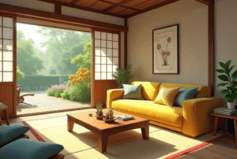

+++
author = "福の家マスター"
categories = ["リフォーム"]
date = 2025-02-21T00:00:00+09:00
tags = ["ハウスメーカー","工務店","ローン"]
title = "マイホームを建て直したい人必見！費用や補助金、流れを解説"
toc = true
description = "マイホームを建て直したいと考えている方へ、費用や補助金の活用法、建て替えの流れを詳しく解説。マイホームを建て直したい人が後悔しないために、無料一括見積もりの重要性や賢いハウスメーカーの選び方を紹介します。"
+++

マイホームを建てたものの、実際に住んでみると後悔してしまうケースは少なくない。

新築であっても、間取りの使い勝手や収納の不足、周辺環境の変化など、住んで初めて気づく問題が多くある。

そのため、もう一度家を建て直したいと考える人も増えている。

しかし、家の建て替えには多くの費用がかかるため、お金がないと諦めてしまう人もいるだろう。

果たして、1000万円で家は建てられるのか、建て替えに使える補助金はあるのか、疑問を持つ人も多いはずだ。

また、人生2回目のマイホームだからこそ、絶対に後悔したくないと考える人もいる。

そんな人のために、建て替えのやることリストや、費用を抑えるための方法、さらには複数のハウスメーカーから見積もりを取る重要性について解説する。

理想の住まいを実現するために、正しい知識を身につけ、最適な方法を選択しよう。


- 住んでみて後悔する理由と建て直しを検討するポイントが分かる
- 家の建て替えが本当に無理なのか、実現可能な選択肢を知ることができる
- 1000万円で家を建てることが可能か、費用のリアルな内訳が分かる
- 古い家の建て替えに利用できる補助金や助成金の活用方法が分かる
- 建て替えの流れと、計画から完成までのやることリストが分かる
- ハウスメーカーの見積もりを比較することでコストを抑える方法が分かる
- 無料の一括見積もりサービスを利用するメリットとその活用方法が分かる


  


✅ **【簡単60秒で一括無料請求！】**  
無料で貰えるリフォームプランで、気にすべきことが明確になり、損しないリフォームができます！！

運営窓口の案内に従って入力すれば、リフォームプラン、費用・見積もり、アイデア＆アドバイスが手に入ります。  
- 比較したい会社の中から、一番良いリフォーム会社が見つかる！
- 失敗したくないと思っているあなたに！
- 一括見積もりでリフォームは変わります！！
- リフォーム、リノベーションのアイデア・アドバイス、プランの提案、費用のお見積りがもらえる！  


🔍リフォーム全般に関することなら この【無料】チャットボットページへ!!


✅ **損しないエクステリア、外構を依頼する業者選びならこちら。**


🔍エクステリア・外構に関することなら この【無料】チャットボットページへ!!




## マイホームを建て直したい！理想の住まいを実現する方法

 


- 住んでみて後悔？もう一度家を建て直したい理由とは
- マイホームの建て替えは本当に無理？意外と知らない選択肢
- 1000万円で家は建てられる？建て替え費用のリアル
- 古い家の建て替えに使える補助金や助成金を活用しよう
- 建て替えの流れとやることリストを徹底解説


### 住んでみて後悔？もう一度家を建て直したい理由とは
家を建てることは、多くの人にとって人生で最も大きな買い物の一つです。

しかし、いざ住んでみると「思っていたのと違った」「こんなはずじゃなかった」と後悔するケースも少なくありません。

実際に住んでみないと分からない問題は多く、特に注文住宅や建売住宅を購入した場合、その後悔の度合いが大きくなることがあります。

例えば、家の間取りが使いにくかったり、収納が不足していたりすると、日常生活にストレスが溜まりやすくなります。

また、周囲の環境が想像していたものと違い、騒音や日当たりの悪さ、交通の不便さなどが気になることもあります。

さらに、家の性能面でも後悔することがあります。

断熱性や気密性が低いために冬は寒く、夏は暑いといった問題が生じると、快適な生活を送るのが難しくなります。

これらの理由から、「もう一度家を建て直したい」と考える人が増えています。

しかし、家の建て直しは簡単な決断ではありません。

大きな費用がかかるうえに、建て直しのためには解体工事や仮住まいの手配など、さまざまな準備が必要になります。

また、ローンを抱えている場合は、新たにローンを組むことができるのかどうかも重要なポイントになります。

それでも、多くの人が「最初の家づくりの失敗を活かして、より理想的な住まいを手に入れたい」と考えています。

実際に2回目の家づくりをした人の中には、「今度はしっかり計画を立てて、本当に住みやすい家を建てることができた」という声も多く聞かれます。

そのため、今の住まいに対して強い不満がある場合は、「建て直すべきかどうか」を冷静に判断することが大切です。

そして、建て直しを検討する際には、前回の失敗を振り返り、どのような点を改善したいのかを明確にすることが重要になります。

### マイホームの建て替えは本当に無理？意外と知らない選択肢
「マイホームを建て替えたいけれど、お金がかかるし、現実的に無理だ」と考えていませんか？

確かに、家を建て替えるとなると費用の問題が大きなハードルになります。

しかし、実は建て替えを実現するためのさまざまな選択肢があるのをご存じでしょうか？

まず、建て替えの費用についてですが、古い家を解体する際にかかる費用や新築工事の費用を考えると、決して安いものではありません。

しかし、自治体によっては「耐震補助金」や「建て替え支援金」などの制度があり、条件を満たせば補助を受けることができます。

また、住宅ローンの種類を工夫することで、月々の負担を抑えながら建て替えることも可能です。

次に、建て替えの方法についても、さまざまな選択肢があります。

例えば、すべてを解体して新しく建て直す「フルリノベーション」や「完全建て替え」だけでなく、一部の構造を残して改築する方法もあります。

これにより、費用を抑えつつ、理想的な住まいに近づけることができます。

さらに、複数のハウスメーカーや工務店に見積もりを依頼することで、よりコストを抑えた建て替え計画を立てることもできます。

「1社だけに相談するのではなく、複数社から見積もりを取ることで、より良い条件で建て替えができる可能性が高くなる」というのは、多くの専門家も指摘しているポイントです。

このように、建て替えは一見すると難しく感じるかもしれませんが、実際には多くの選択肢があり、工夫次第で実現可能になります。

「今の住まいに満足できない」「もっと快適な家に住みたい」と思っているなら、諦めるのではなく、まずは専門家に相談してみることをおすすめします。

### 1000万円で家は建てられる？建て替え費用のリアル
「家を建て替えたいけれど、予算が限られている」「1000万円で家は建てられるの？」と疑問に思う方もいるでしょう。

結論から言えば、1000万円で家を建てることは可能ですが、条件によっては厳しい場合もあります。

まず、家を建てる際の費用には、大きく分けて「解体費用」「建築費用」「諸費用」の3つがかかります。

解体費用は、家の大きさや構造によって異なりますが、一般的な木造住宅の場合、100万円〜200万円程度が相場とされています。

次に、建築費用ですが、30坪程度の家を建てる場合、坪単価が50万円だとすると、約1500万円の費用がかかります。

しかし、ローコスト住宅メーカーを利用したり、平屋のコンパクトな設計にすることで、建築費を抑えることも可能です。

また、土地の状況によっては「地盤改良工事」が必要になり、これに数十万円から数百万円の費用がかかることもあります。

さらに、仮住まいの費用や登記費用などの諸費用も加算されるため、総額として1000万円で収めるのは難しいケースが多いです。

しかし、建て替えの方法を工夫することで、費用を抑えることは十分に可能です。

例えば、「一部リフォームを取り入れる」「小規模な家にする」「ハウスメーカーのキャンペーンを活用する」などの方法があります。

また、自治体の補助金を活用することで、負担を軽減することもできます。

1000万円で家を建てることは決して不可能ではありませんが、慎重な計画と工夫が必要です。

まずは、複数のハウスメーカーに見積もりを依頼し、費用の詳細を確認することが大切です。

そして、自分の希望する条件と予算をすり合わせながら、最適な方法を選びましょう。

### 古い家の建て替えに使える補助金や助成金を活用しよう
家の建て替えを考える際、費用の負担が大きな悩みとなることが多いです。

しかし、自治体や国の補助金・助成金を活用することで、建て替え費用の一部を軽減することができます。

知らないまま建て替えを進めてしまうと、本来受けられるはずの補助金を活用できず、大きな損をすることもあります。

そのため、事前にどのような補助制度があるのかを確認し、条件を満たすように計画を立てることが重要です。

まず、多くの自治体で実施されているのが「耐震改修補助金」です。

これは、旧耐震基準（1981年以前）で建てられた住宅を対象に、耐震性を向上させるための建て替えや改修を支援する制度です。

耐震診断の費用から、実際の建て替え工事費用まで補助してくれるケースもあり、最大100万円以上の支援が受けられる場合もあります。

次に、「長期優良住宅認定制度」に基づく補助金も注目すべき制度の一つです。

長期優良住宅とは、耐久性や省エネ性能に優れた家のことで、この認定を受けると補助金が支給されたり、住宅ローン減税の優遇が受けられたりします。

また、固定資産税の減額措置が適用される場合もあるため、建て替え後の負担も軽減されるメリットがあります。

また、「ゼロエネルギー住宅（ZEH）補助金」も活用できます。

これは、省エネ設備を導入してエネルギー消費を抑えた住宅に対して支給される補助金で、場合によっては100万円以上の支援が受けられることもあります。

太陽光発電や高断熱の設備を導入することで、補助金の対象となり、さらに光熱費の削減にもつながるため、長期的にみても経済的なメリットが大きいです。

さらに、自治体によっては「空き家対策補助金」や「地域活性化住宅支援」など、独自の補助金制度を設けていることもあります。

特に、過疎地域や地方都市では、空き家を解体して新しく住宅を建てる場合に補助金が出るケースもあります。

これらの補助金制度は地域によって異なるため、市区町村の役所や公式ホームページを確認することが重要です。

補助金や助成金を利用するためには、事前に申請が必要なものも多く、建て替え計画を進める前に情報収集をしっかり行うことが大切です。

また、補助金の申請には期限がある場合もあるため、スケジュールを確認しながら計画を進めるようにしましょう。

建て替えを検討しているなら、活用できる補助金制度を事前に調べ、少しでも費用負担を減らす工夫をすることが賢明です。

### 建て替えの流れとやることリストを徹底解説
家の建て替えは、新築を建てるのとは異なり、解体や仮住まいの手配など、やるべきことが多くなります。

全体の流れを理解し、計画的に進めることでスムーズに建て替えを完了させることができます。

ここでは、建て替えの流れとやるべきことを分かりやすく解説します。

まず最初に行うべきなのが、「建て替えの計画を立てる」ことです。

どのような家に建て替えたいのか、どの程度の費用をかけられるのかを明確にし、スケジュールを立てます。

この段階で、住宅ローンを利用する場合は金融機関への相談も行い、必要な資金計画を立てておくことが大切です。

次に、「ハウスメーカーや工務店の選定」を行います。

家を建てる会社によって、工法やデザイン、価格が異なるため、複数社から見積もりを取って比較することが重要です。

また、建て替えの場合は「解体工事」が必要になるため、解体費用を含めた総額を把握しておくことも必要です。

ハウスメーカーを決定したら、「設計プランの打ち合わせ」を行います。

この段階では、間取りや設備、仕様を決めていきます。

予算内で理想の家を建てるために、優先順位をつけて必要なものと不要なものを明確にしておくことが大切です。

次に、「仮住まいの準備と引っ越し」を行います。

建て替え工事が始まると、元の家に住み続けることができないため、仮住まいを手配しなければなりません。

短期間の賃貸住宅やマンスリーマンションを利用するケースが多く、契約期間や家賃を考慮しながら選びましょう。

また、引っ越しの準備を早めに進め、不要な家具や荷物を処分することも重要です。

その後、「解体工事と地盤調査」を実施します。

家を解体する際には、近隣への騒音や粉じんの影響があるため、事前に近所の方へ挨拶をしておくとトラブルを防げます。

また、解体後には地盤調査を行い、必要に応じて地盤改良工事を行うことになります。

地盤が弱い場合は、補強工事が必要になり、追加費用がかかることもあるため、予算に余裕を持たせておくと安心です。

解体工事が完了したら、「新築工事」が始まります。

基礎工事から始まり、建物の骨組みを作り、内装や設備を整えていきます。

工事中は定期的に現場を訪れ、進捗状況を確認し、必要に応じて打ち合わせを行いましょう。

建物が完成したら、「引き渡しと登記手続き」を行います。

新しい家の完成後、建築会社から鍵を受け取り、建物のチェックを行います。

また、固定資産税や登記手続きなどの必要な手続きを済ませ、引っ越しの準備を進めます。

最後に、「新居への引っ越しとアフターメンテナンス」を行います。

新しい家での生活をスタートさせる前に、家具や家電の配置を決め、スムーズに引っ越しを終えられるように計画を立てましょう。

また、建て替え後も定期的なメンテナンスが必要になるため、住宅会社のアフターサポートを活用し、長く快適に住めるように管理することが大切です。

このように、家の建て替えには多くのステップがありますが、事前に流れを把握し、計画的に進めることでスムーズに進行させることができます。

建て替えを検討している方は、全体の流れを理解し、スケジュールをしっかりと立てて進めることが重要です。

  

## マイホームを建て直したいなら一括見積もりが必須！

 


- 家を建て替えるなら複数社の見積もりを取るべき理由
- ハウスメーカー1社だけでは損？比較することで得られるメリット
- 「タウンライフ家づくり」で無料一括見積もりする方法
- 有名ハウスメーカーの見積もりが簡単に手に入る理由とは
- マイホームを建て直したいなら、まずは無料見積もりを！


### 家を建て替えるなら複数社の見積もりを取るべき理由
家を建て替える際に、1社だけに見積もりを依頼するのはリスクが高いです。

なぜなら、同じ条件の家を建てる場合でも、ハウスメーカーや工務店によって費用が大きく異なるからです。

また、工法や設備、アフターサポートの充実度にも違いがあります。

そのため、1社だけの見積もりで決めてしまうと、後から「もっと安くできたかもしれない」「他社ならもっと良い条件だったかも」と後悔する可能性があります。

複数社に見積もりを依頼することで、各社の強みや特徴を比較でき、自分に合った最適なプランを見つけやすくなります。

例えば、あるハウスメーカーでは「標準仕様で高性能な断熱材が含まれている」が、別の会社では「オプション扱いで追加費用がかかる」というケースもあります。

また、同じ設備を導入する場合でも、メーカーによって割引率が違うため、総費用に数百万円の差が出ることも珍しくありません。

さらに、見積もりを複数取ることで、各社に競争意識が生まれ、価格交渉がしやすくなるメリットもあります。

「他社ではこの金額だったが、こちらではどれくらい対応してもらえるか」と相談することで、値引きやサービスの追加を引き出せる可能性が高まります。

以上の理由から、家を建て替える際は必ず複数のハウスメーカーや工務店に見積もりを依頼し、慎重に比較することが大切です。

### ハウスメーカー1社だけでは損？比較することで得られるメリット
ハウスメーカー1社だけで家を建て替えると、後から「もっと安くできたかもしれない」「他に良いプランがあったのでは？」と後悔することがあります。

なぜなら、ハウスメーカーごとに提供するプランや価格、仕様が異なるため、比較をしないと本当にお得な選択ができないからです。

例えば、同じ間取りの家でも、あるメーカーでは2000万円、別のメーカーでは2500万円かかることがあります。

この価格差は、建材の仕入れ価格や企業の利益率、工法の違いによるものです。

また、保証期間やアフターメンテナンスの内容もメーカーごとに違いがあり、長期的な視点で考えるとトータルコストに大きな影響を与えます。

比較することで、コスト面だけでなく、各メーカーの強みや弱みを把握することができます。

例えば、耐震性に優れた家を建てたいならA社、デザイン性にこだわりたいならB社、省エネ住宅を重視するならC社といった選択肢が見えてきます。

こうした情報を得ることで、より自分の理想に近い家を建てることが可能になります。

また、比較をすることで交渉の余地も生まれます。

複数の見積もりを持っていると、「他社ではこの設備が標準仕様だった」「他社ではこの価格で建てられる」と交渉できるため、より良い条件で契約できる可能性が高まります。

そのため、ハウスメーカーを1社だけに絞るのではなく、必ず複数のメーカーから見積もりを取り、慎重に比較検討することが重要です。

### 「タウンライフ家づくり」で無料一括見積もりする方法
家を建て替える際に、複数のハウスメーカーや工務店に個別に見積もりを依頼するのは手間がかかります。

そこで便利なのが「タウンライフ家づくり」の無料一括見積もりサービスです。

このサービスを利用すれば、一度の申し込みで複数のハウスメーカーから見積もりを取ることができるため、効率よく比較検討ができます。

タウンライフ家づくりの利用方法は非常に簡単です。

まず、公式サイトにアクセスし、必要な情報を入力します。

「建て替えを希望するか」「どんな間取りを希望するか」「予算はいくらか」などの基本的な情報を記入すると、それに合ったハウスメーカーが提案を送ってくれます。

このサービスの大きなメリットは、自分の希望に合ったプランや見積もりを無料で入手できることです。

また、複数のメーカーの見積もりが揃うため、比較しながら最適な選択ができます。

さらに、一括見積もりを利用することで、メーカー同士が競争意識を持ち、より良い条件での提案を受けやすくなるのも利点です。

「どのハウスメーカーが良いか分からない」「複数の会社に見積もりを依頼するのが面倒」と感じている方には、タウンライフ家づくりの一括見積もりサービスを活用するのがおすすめです。

### 有名ハウスメーカーの見積もりが簡単に手に入る理由とは
家の建て替えを検討する際、どのハウスメーカーが自分に合っているのかを見極めることが重要です。

しかし、個別に問い合わせて見積もりを取得するのは時間がかかり、手間もかかります。

特に、各ハウスメーカーは独自のプランや仕様を持っているため、比較しやすい形で見積もりを集めることが難しいと感じる方も多いでしょう。

そのため、一括で見積もりを取得できるサービスを利用することで、手間をかけずに複数のハウスメーカーの提案を受け取ることが可能になります。

一括見積もりサービスを活用すると、一度の申し込みで複数のハウスメーカーから見積もりが届きます。

そのため、各社の価格や仕様、サービスの違いを一目で比較できるメリットがあります。

例えば、あるハウスメーカーでは「標準仕様で高性能な断熱材が含まれている」が、別のメーカーでは「オプション扱いで追加費用がかかる」といった違いを簡単に把握することができます。

また、一括見積もりを利用すると、メーカー同士の競争意識が生まれ、通常よりも良い条件を提示される可能性が高くなります。

さらに、一括見積もりを利用することで、個別にハウスメーカーとやり取りする負担を減らすことができます。

通常、見積もりを取るためには各社と面談し、それぞれに希望条件を伝えなければなりませんが、一括見積もりなら、必要な情報を一度入力するだけで済みます。

その結果、スムーズに複数の見積もりを取得し、効率的に比較することができます。

ハウスメーカーを選ぶ際には、価格だけでなく、耐震性や断熱性能、保証内容、デザインの自由度など、さまざまな要素を考慮する必要があります。

そのため、一括見積もりサービスを利用して、まずはどのメーカーが自分の希望に合っているかを確認することが大切です。

無料で利用できるため、気軽に試してみることをおすすめします。

### マイホームを建て直したいなら、まずは無料見積もりを！
マイホームを建て直したいと考えていても、「費用が高くて無理なのでは？」と思っている方は多いのではないでしょうか。

しかし、建て替えの費用は、複数のハウスメーカーや工務店の見積もりを比較することで大幅に抑えられる可能性があります。

そのため、まずは無料で見積もりを取得し、実際の費用感を把握することが重要です。

無料見積もりを依頼することで、次のようなメリットがあります。

まず、自分の予算内で建て替えが可能かどうかを具体的に知ることができます。

ハウスメーカーによっては、低コストで高品質な家を建てられるプランを用意していることもあるため、思ったよりも手の届く価格で理想の住まいを実現できるかもしれません。

また、見積もりを取得することで、どの部分にどれくらいの費用がかかるのかが明確になり、無駄な出費を抑えるための対策を立てることができます。

さらに、無料見積もりを活用すると、ハウスメーカーごとの特徴や強みを比較することができます。

例えば、デザインに強いメーカー、コストパフォーマンスに優れたメーカー、長期保証が充実しているメーカーなど、それぞれに違いがあります。

それを事前に把握することで、自分にとって最適な選択ができるようになります。

また、無料見積もりを取得することで、業者との交渉がしやすくなります。

複数の見積もりを持っていると、「他社ではこの設備が標準仕様だった」「この価格で提供してくれるところもあった」といった情報をもとに価格交渉をすることができ、より良い条件で契約できる可能性が高まります。

建て替えを成功させるためには、まず情報を集め、しっかりと比較検討することが不可欠です。

無料で見積もりを取得できるサービスを利用し、自分に最適なハウスメーカーを見つけましょう。

そうすることで、コストを抑えながら理想の住まいを手に入れることができるはずです。


- 住んでみて後悔し、もう一度家を建て直したい人が増えている
- マイホームの建て替えは無理ではなく、選択肢が多く存在する
- 1000万円で家を建てることは可能だが、条件次第で難しい場合もある
- 古い家の建て替えには補助金や助成金を活用できる
- 建て替えの流れを理解し、計画的に進めることが重要
- 家を建て替える際は複数社の見積もりを取るべき
- ハウスメーカー1社だけでは損をする可能性がある
- 「タウンライフ家づくり」を使えば無料で一括見積もりができる
- 有名ハウスメーカーの見積もりを簡単に比較できるサービスがある
- 建て替えの費用を抑えるためには事前の情報収集が必須
- 住宅ローンや補助金を活用し、負担を軽減する方法がある
- 建て替え後の快適な生活を考え、断熱性や耐震性も重視すべき
- 施工業者ごとにコストや仕様が異なるため比較が不可欠
- 建て替え前に、仮住まいや引っ越しの準備も忘れずに行う
- 計画的な家づくりを進めることで、後悔のないマイホームが実現する



✅ **【簡単60秒で一括無料請求！】**  
無料で貰えるリフォームプランで、気にすべきことが明確になり、損しないリフォームができます！！

運営窓口の案内に従って入力すれば、リフォームプラン、費用・見積もり、アイデア＆アドバイスが手に入ります。  
- 比較したい会社の中から、一番良いリフォーム会社が見つかる！
- 失敗したくないと思っているあなたに！
- 一括見積もりでリフォームは変わります！！
- リフォーム、リノベーションのアイデア・アドバイス、プランの提案、費用のお見積りがもらえる！  


🔍リフォーム全般に関することなら この【無料】チャットボットページへ!!


✅ **損しないエクステリア、外構を依頼する業者選びならこちら。**


🔍エクステリア・外構に関することなら この【無料】チャットボットページへ!!



